# CargoRewind

[](https://github.com/vipul21435/cargorewind/actions/workflows/ci.yml)

Rebuild a Rust crate at a historical commit inside a digest-pinned Docker image and
prove that a fix commit flips its new tests from failing to passing. CargoRewind is
typed Python that drives git, cargo and Docker. cargo only ever runs inside containers,
so the host needs git and Docker but no Rust toolchain.

Give it a repository and a fix commit. It exports a benchmark-style task bundle:
`task.json` (schema 2, validated against a committed JSON Schema) with FAIL_TO_PASS
and PASS_TO_PASS lists (each test rerun by exact name, flaky ones set aside with a
reason, and a per-test table with the command that reruns it), the same lists as
`fail_to_pass.txt` and `pass_to_pass.txt`, the environment `Dockerfile`, a
`test.patch`, a `fix.patch`, the base tree as a one-commit `base.bundle`, a
`split.json` report of how the diff was divided, a `toolchain.json` report of how the
toolchain was chosen, a `lock.json` report of how the dependencies were fixed (plus
the `Cargo.lock` it wrote when the commit had none), a `probes.json` report of the
sanity probes that prove the fix is absent at base and present after it, the
`recipe.json` whose hash names the image, and the logs of every run.
`cargorewind verify` rebuilds a task from its bundle alone and checks the flip again;
`cargorewind batch` runs a TOML file of fixes, skips duplicates and writes a summary
table.

## What works today

- **One command, end to end.** `cargorewind rewind <repo> --fix <sha>` clones (or
  fetches) a URL, a local path or a git bundle. It resolves the base commit (by default
  the fix's first parent), splits the diff, picks the toolchain, builds the
  environment, runs the suite three times, reruns every candidate test by exact name
  and writes the bundle.
- **Rust-aware test and fix patch split.** Every changed file gets a Cargo layout
  role: `test`, `source`, `bench`, `example`, `build-script`, `manifest`, `lockfile` or
  `other`. Packages come from every `Cargo.toml`, workspace membership from
  `[workspace] members` globs (`*`, `?`, `[..]`, `**`) minus `exclude`, and targets
  from `[lib]`, `[[bin]]`, `[[test]]`, `[[bench]]`, `[[example]]` and
  `package.build`, custom paths included, plus Cargo's auto-discovery (honoring
  `autotests = false` and the other auto flags). A module-tree walk from each target
  root follows `mod name;` the way rustc resolves it (`name.rs`, `name/mod.rs`,
  `#[path]`, declarations nested in inline modules), so a module file reached only
  through `#[cfg(test)] mod tests;` goes to `test.patch` whole. A plain `mod tests;`
  whose file starts with `#![cfg(test)]` goes to `test.patch` together with that file.
  A crate under a `tests/` directory that no workspace lists (for example
  `tests/fixtures/<name>/Cargo.toml`) is test data of the enclosing package, not a
  package. Files the walk cannot reach fall back to path conventions, where any
  `tests/` directory (also below `src/`) means test data. The walk only descends
  toward changed files.
- **A small Rust lexer instead of a brace scan.** It skips line, doc and nested block
  comments and knows strings, raw strings (`r#"..."#`), byte and C strings, char and
  byte literals, lifetimes, labels and raw identifiers. On top of it, the scanner finds
  test-only code: inline `#[cfg(test)]` modules, out-of-line `#[cfg(test)] mod name;`
  declarations, single items, fields and statements, inner `#![cfg(test)]`, and
  compound predicates. `cfg(all(test, ...))` and `cfg(any(test, doctest))` count;
  `cfg(not(test))` and `cfg(any(test, feature = "x"))` do not. An attributed `if`,
  `for`, `match` or loop statement ends at its closing brace, `let`, `static` and
  `const` end at their semicolon, and braces inside generics (`impl Foo<{ N }>`) are
  not an item's body. Changed lines inside those regions go to `test.patch`, the rest
  to `fix.patch`. Hunk ranges and "No newline at end of file" markers are recomputed
  for the intermediate tree, and diffs are split on `\n` only, so CRLF files and form
  feeds survive.
- **`cargorewind split` and `split.json`, no Docker needed.** The command prints each
  file's role and patch, the test-only regions and the hunks of files shared by both
  patches. It writes `test.patch`, `fix.patch` and `split.json`, which lists packages
  and targets, per-file decisions with reasons, every shared-file hunk with its header
  in each patch, the `cfg(test)` regions and the check results.
- **Split proof.** `git apply --check` must accept `test.patch` on a clean checkout of
  base and `fix.patch` on top of it. Then both are applied, and the result has to match
  the fix commit's blob ids for every touched path. `rewind` runs the same checks and
  stops before Docker if one fails. Runs that share a work checkout take turns through
  an `flock` on it, so parallel `split` or `rewind` runs of one repository do not break
  each other.
- **Toolchain inference with a reason for every step.** Toolchain files are read with
  rustup's rules. `rust-toolchain.toml` gives `channel`, `components`, `targets` and
  `profile`. The legacy `rust-toolchain` file can be a bare channel line or the same
  TOML, and it wins when both files exist, as it does in rustup. Channel forms:
  - an exact version (`1.56` becomes the newest `1.56.x`);
  - `stable-YYYY-MM-DD`, which becomes the release of that day;
  - dated `nightly-YYYY-MM-DD` and `beta-YYYY-MM-DD`;
  - undated `nightly` and `beta`, which become the channel of the day before the
    commit.

  A host-triple suffix is dropped. With no file, or an undated `stable`, CargoRewind
  uses the newest stable release published on an earlier UTC day than the fix. The
  result is then raised to the highest floor from the root package and the root
  workspace's members:
  - every `package.rust-version`, including `rust-version.workspace = true` inherited
    from `[workspace.package]`;
  - the edition minimum (2018 -> 1.31, 2021 -> 1.56, 2024 -> 1.85), including
    per-target `edition` keys;
  - 1.64 when a manifest inherits from the workspace;
  - the oldest cargo that reads the committed `Cargo.lock` (format v2 -> 1.41,
    v3 -> 1.53, v4 -> 1.78).

  Dated channels are installed with rustup on the pinned `rust:1.98.1-slim` image.
  They are never raised; a warning is recorded when one looks older than a floor.
  `cargorewind toolchain` prints each decision, and `toolchain.json` records them all.
- **Tested release table.** All 140 stable releases from 1.0.0 to 1.98.1 (41 of them
  point releases), parsed from rust-lang/rust `RELEASES.md`. Invariant tests check
  that versions and dates increase, that minors are consecutive and 41 to 43 days
  apart on Thursdays (with the three real exceptions), and that every point release
  follows its predecessor and comes before the next minor.
- **Digest-pinned images, offline or from the registry.** By default the base image
  comes from an offline table of multi-arch `rust:<version>-slim` index digests
  (10 versions). `--registry` looks the tag up in the Docker Hub registry HTTP API:
  an anonymous pull token, then a HEAD request whose `Docker-Content-Digest` is the
  index digest (HEAD does not count as a pull). Answers are cached in a JSON file
  (`--cache-dir`, default `~/.cache/cargorewind`), and the offline table is the
  fallback when the registry cannot answer. `task.json` records where the digest
  came from. `--image name@sha256:...` overrides both.
- **Dependencies fixed three ways.** A committed `Cargo.lock` has its format version
  detected (v1 to v4, including the pre-1.22 `[root]` table) and is fetched with
  `cargo fetch --locked`. Without one, a crate with no crates.io dependencies lets
  cargo write the lockfile in the image. The manifests read for that are the root, the
  workspace members and every path dependency they reach; a git dependency (or a path
  dependency outside the repository) can bring crates.io packages too, so it counts as
  one. Otherwise the lockfile is **bounded by the commit date**: cargo generates one in
  a container of the chosen toolchain, and a pin loop moves every crates.io entry
  published at or after the fix commit's committer time to the newest non-yanked
  version published before it that satisfies every requirement on it (from the
  manifests, or from the index entry of each dependent's locked version). A dependent
  that asks for the same crate twice (a renamed second version, optional aliases)
  constrains each lockfile edge only with the requirement its locked version meets,
  the one cargo resolved. It runs `cargo update -p name:version --precise`,
  reads the lockfile again and repeats from the top of the dependency graph down,
  because older versions bring older transitive dependencies. If cargo refuses a pin,
  the next older version is tried. Entries that cannot be bounded are reported, and
  `cargorewind lock` exits 2.
- **crates.io metadata from the sparse index.** One request per crate to
  `https://index.crates.io` gives every version's publish time (`pubtime`), yanked
  flag, `rust_version` and dependencies. Answers are cached as JSON (`--cache-dir`,
  for `lock` and `rewind`) and refetched only when they are older than the commit.
  Each cache write goes through a temporary file of its own, so parallel runs can
  share the cache; a cache that cannot be written is noted in `lock.json`, and the
  fetched answer is still used. `--index-dir` reads
  recorded files in the same layout instead, which the tests and the offline demo use.
  Requirements follow cargo's semver rules: caret, tilde, wildcards, `=`, `>`, `>=`,
  `<`, `<=`, comma-separated bounds and the pre-release rule.
- **Vendoring for offline builds.** `--vendor` runs `cargo vendor --locked` in the
  image, writes the source replacement to `~/.cargo/config.toml` (`config` before cargo
  1.39), and builds and runs every stage with `--offline` under
  `docker run --network none`. It is refused below cargo 1.37, which has no
  `cargo vendor`.
- **Dockerfile rendered from a typed, hashed recipe.** A `Recipe` holds everything the
  image depends on: the digest-pinned base image, the toolchain and what rustup adds,
  the base commit, the lock strategy (and the sha256 of a lockfile cargorewind wrote),
  vendoring, the probe identifiers, and the warm-build and test commands. Rendering is
  a pure function of it, and five golden Dockerfiles pin every byte. Every field that
  reaches a Dockerfile line is checked with `fullmatch` when the recipe is created, so
  no value can carry a newline or shell syntax into the file. The recipe hash is the
  sha256 of its canonical JSON (sorted keys, no whitespace, ASCII) followed by the
  Dockerfile body it renders (every line but the label), so a template change in a
  newer cargorewind is a new recipe and never reuses an image built from the old
  template. It is written to `recipe.json` (with the body's own sha256) and is the
  image tag (`cargorewind/<repo>:<first 16 hex digits>`), the `cargorewind.recipe`
  label and the build cache key. The file has a pinned base,
  non-root user, `LABEL project=cargorewind`, `CARGO_BUILD_JOBS=2`, one of the three
  dependency strategies above and a warm `cargo test --no-run`. A date-bounded lockfile
  adds a `toolchain` stage: it is rendered on its own for the pin loop, and the final
  stage (rendered once the lockfile's hash is known) copies the lockfile in. As root,
  before the user switch, it runs
  `rustup toolchain install` for a dated channel and `rustup component add` or
  `target add` for what the toolchain file lists. It sets `RUSTUP_TOOLCHAIN` whenever
  the base checkout has a toolchain file or a patch adds or changes one, so rustup
  cannot switch to the file's channel at run time (for example `stable`, which would
  mean today's stable and cannot be installed under `--network none`). Toolchain
  files that are symlinks (a legacy `rust-toolchain` pointing at
  `rust-toolchain.toml`) are read through the link, like rustup does.
- **Sanity probes: the fix is absent at base and present after it.** A probe is a
  `fn`, `struct`, `enum`, `trait`, `const` or `macro_rules!` name that the patches
  define on an added line, found with the Rust lexer (so names in comments, strings
  and doc examples do not count; `const fn`, const generics and `*const T` are not
  consts). Only names that occur nowhere in the base commit's `*.rs` files as a whole
  word (`git grep -w`) are kept, because for those a plain `grep -w` in a container is
  exact; the others are listed as skipped, with the files they occur in. At most 16
  are kept, the fix's own names first. The probes are checked three times: on the
  host against the exact files each stage receives (absent at base, the test's names
  defined in the before tree and the fix's names not yet, every name defined after);
  in the image build, where a `RUN grep` step fails the build if any name exists in
  the checkout it copied; and in the before and after runs, where the stage script
  greps the unpacked checkout and exits 97 before cargo runs if a name is missing.
  Together with the `git apply --check` results of the split they form
  `probes.json`, and a failed probe makes `rewind` exit 2 even when the flip holds.
- **Recipe-hash build cache.** `rewind` looks the recipe hash up in a JSON index
  (`build-index.json` in the cache directory) and reuses the image instead of building
  it. A hit needs Docker to still have an image under the indexed tag whose
  `cargorewind.recipe` label equals the hash, so a deleted or retagged image is
  rebuilt, never trusted. Each recipe has its own `flock`, held from the lookup to the
  end of the build: a second run of the same recipe waits and then reuses the image
  instead of building it twice (and gives up with an error after the timeout). Index
  writes take a short lock of their own and replace the file atomically.
  `--rebuild` skips the lookup and builds with `docker build --no-cache`, then prunes
  dangling images with the `label=project=cargorewind` filter only.
  `cargorewind cache list` shows the index; `cargorewind cache prune` removes this
  project's dangling images and the entries whose image is gone.
- **Three isolated runs.** base (no patches), before (test patch) and after (test and
  fix patches). Each run streams its changed files into
  `docker run --network none` as a tar on stdin, so it needs no bind mounts and no git
  or `patch` inside the old image.
- **libtest parser for both formats, per test binary.** One pass reads the text
  format every toolchain prints and the JSON format (`-- -Z unstable-options --format
  json`, requested automatically on nightly channels), and follows cargo's `Running`
  and `Doc-tests` lines to know which binary a result belongs to (the old
  `Running target/debug/deps/x-<hash>` and the newer `Running unittests src/lib.rs
  (...)`, `Running tests/it.rs (...)`). It handles `ok`, `FAILED`, `ignored` with or
  without a reason, `should panic`, `compile fail` and `compile` suffixes (display
  only, stripped so names match `--exact`), bench lines, `<0.1s>` report times,
  `running N tests` and `test result:` summaries. Output of the tests themselves does
  not confuse it: with `--nocapture` or `--test-threads=1` libtest prints
  `test name ... ` first and the status after the test's output, and a panic in a
  spawned thread can land in the middle of a result line; such a line stays pending
  until a line that is only a status. A test that started and never reported failed
  (the binary died) or timed out (the run was stopped). Doctest names get a per-item
  ordinal instead of the line number, so they stay stable when a patch shifts lines.
  The fixtures are real `cargo test` outputs of an original crate that produces every
  one of those lines (`tests/fixtures/libtest/zoo`), recorded on rust 1.39.0, 1.73.0
  and 1.98.1 in text, `--nocapture --test-threads=1` and JSON form; all nine
  recordings parse to the same 21 results.
- **Tests keyed by cargo target.** Each test binary is mapped to its target through
  the layout of the fix and base commits: the library (`--lib`), a binary
  (`--bin name`), an integration test (`--test name`), a bench, an example, or the
  doctests (`--doc`); targets the layout does not list are recognised by their source
  path, and old cargo output (binary name only) falls back to kind order, with an
  `unknown` target as the last resort. A test's id is its name, qualified as
  `name [test it]` only when two targets have a test of that name, so the strsim-rs
  task keeps the plain names. `task.json` lists every test with its target, its
  status in each run and the command that reruns it, shell-quoted, so a doctest
  filter such as `Parser<'a>::new` is one argument when the line is pasted into `sh`.
- **Reruns by exact name and flaky detection.** Every FAIL_TO_PASS and PASS_TO_PASS
  candidate is rerun with `cargo test --lib|--test <name>|--bin <name> -- --exact
  <test>` three times (`--reruns`, 0 turns it off) in the stages that decided it:
  `after` for all, `before` for the tests that run reported, `base` for a
  PASS_TO_PASS test whose verdict came from the base run because `before` did not
  build. Doctests are the exception: rustdoc splits its test arguments on whitespace,
  so a doctest name cannot be passed whole; they are rerun with their item path as the
  filter (`cargo test --doc -- hamming`) and the exact name is picked from the output.
  Each command runs under a per-test `timeout` (`--test-timeout`, default 300 s) in
  one container per stage, and every outcome is explicit: `passed`, `failed`,
  `ignored`, `compile-error` (the command showed a build error and no binary
  started), `timeout` or `missing` (the run finished without reporting the test). A
  candidate whose outcome differs between its stage run and any rerun is flaky: it
  leaves both lists and `task.json` records the reason with every outcome. The flip
  stays verified when a FAIL_TO_PASS test remains.
- **Flip rules.** When the before run fails to compile, the base run decides whether
  an existing test counts as PASS_TO_PASS instead of inflating FAIL_TO_PASS.
  Regressions block verification.
- **Record and replay.** `--record` writes a transcript of the Docker builds, test runs
  and pin-loop session steps. `--replay` answers from that transcript offline, but only
  when the Dockerfile, every file overlay, every stage script (with its probe words)
  and every session script are byte-identical to the recorded ones, checked by sha256.
  The build cache is off for both, so a transcript always holds a real build.
- **A versioned task bundle (schema 2).** `task.json` is typed twice: dataclasses in
  `bundle.py`, and a JSON Schema 2020-12 document shipped in the package
  (`cargorewind/schemas/task.schema.json`) with `additionalProperties: false`
  everywhere, enums for statuses, run states and lock strategies, and patterns for
  commits and sha256 digests. Every write and every read is validated. The base tree
  travels as `base.bundle`, a git bundle of one root commit made from the base
  commit's tree with a fixed author, committer and date: its id is reproducible, its
  tree id equals the base commit's (both are recorded), and it holds no history
  (11,765 bytes for strsim-rs, whose history bundle is 657 KB). `task.json` records
  the sha256 of every other file in the bundle.
- **`cargorewind verify <bundle>` rebuilds from the bundle alone.** It reads nothing
  outside the directory. First it checks consistency: every file against its
  recorded sha256, `recipe.json` against the recorded hash, the bundle's `Dockerfile`
  against what `recipe.json` renders (byte for byte), the lockfile's sha256 for a
  date-bounded recipe, and the probe words. Then it clones `base.bundle` (tree id
  checked), applies both patches, and runs the build, the three stages and the
  reruns again. The new FAIL_TO_PASS and PASS_TO_PASS lists must equal the recorded
  ones. An inconsistent bundle is an error before anything is built (exit 1); a flip
  or a list that does not hold again is NOT VERIFIED (exit 2). The report goes to
  `<bundle>/verify/` (`verify.json` and logs), never into the bundle's own files. The
  default checkout, `.cargorewind/verify-<dir>-<8 hex>`, is keyed by the resolved
  bundle path, so two bundles in directories of one name never share it.
- **A checkout only ever holds the source it was asked for.** The default work
  directory of `split`, `toolchain`, `lock` and `rewind` is
  `.cargorewind/<slug>-<8 hex>` (a digest of the URL, or of the resolved local path),
  and an existing checkout is only fetched when its `origin` is that source; a
  checkout of another source is cloned again.
- **A bundle directory is rewritten, not topped up.** `rewind` first removes every
  bundle file (the Dockerfile, patches, lists, reports, `Cargo.lock`, `task.json`,
  `logs/*.log` and an earlier `verify/` result) from `--out`, so reusing a directory
  never lets `task.json` vouch for another task's lockfile or logs. Other files there
  are left alone.
- **`cargorewind batch recipes.toml` for many fixes.** A TOML file lists `[[task]]`
  tables (`repo` and `fix`, optionally `base`, `name`, `vendor`, `image`,
  `index_dir`, `replay`, `reruns`, `test_timeout`) and `[defaults]` (`vendor`,
  `image`, `index_dir`, `reruns`, `test_timeout`) that every task inherits; unknown
  keys and wrong types are rejected with the task number. Local paths are relative to
  the recipes file; `scheme://` URLs and git's scp-like `[user@]host:path` form (a
  colon before the first slash, e.g. an `~/.ssh/config` alias `gh-work:owner/repo.git`)
  stay URLs unless that path exists, as `git clone` decides. Each repository source
  gets its own checkout. Two tasks are the same task when the repository slug, the
  resolved fix commit, the resolved base commit (explicit, or the first parent),
  `vendor` and `image` agree (a bundle and a URL of one repository, a short and a full
  SHA): once one has a verdict, the others are reported as duplicates and do not run;
  after an error, the next spelling does run. A task with another base is another
  task. Each task writes its own bundle directory; bundle names are compared without
  case and Unicode normalization (as APFS on macOS does), so `Demo` after `demo` is
  an error of the later task, not a shared directory. An error in one task (a missing transcript, an unknown commit, a
  failed build) is recorded and the batch goes on, and the batch prints a summary
  table and writes it as `summary.json` and `summary.md`. `--live` ignores the replay
  files and runs every task through Docker.

## Quickstart

```sh
git clone https://github.com/vipul21435/cargorewind && cd cargorewind
make install     # uv sync --frozen
make demo        # offline: replays the recorded Docker runs of a real strsim-rs fix
make split-demo  # offline: only the patch split of the same fix, with split.json
make toolchain-demo  # offline: every toolchain decision for the same fix, toolchain.json
make lock-demo   # offline: replays the pin loop that bounds which-rs's lockfile by date
make verify-demo # offline: rebuilds the demo task from its bundle alone (replayed runs)
make batch-demo  # offline: examples/batch.toml, two real fixes and a duplicate, summary
make check       # ruff, mypy --strict, pytest with the 90% coverage gate
make demo-live   # needs Docker: builds rust:1.39.0-slim and runs all three stages
make lock-demo-live  # needs Docker: the same pin loop with real cargo in rust:1.73.0-slim
make batch-live  # needs Docker: examples/batch.toml through Docker
make e2e         # needs Docker: the live e2e tests (flips, pin loops, verify, cache, probe)
```

## Usage

```sh
cargorewind split <git-url | path | bundle> --fix <sha> [--base <sha>] [--out out/split]
    [--workdir .cargorewind/<name>-<digest>]
cargorewind toolchain <git-url | path | bundle> <fix-sha> [--base <sha>]
    [--json toolchain.json] [--workdir .cargorewind/<name>-<digest>]
    [--registry | --offline] [--cache-dir ~/.cache/cargorewind]
cargorewind lock <git-url | path | bundle> <fix-sha> [--base <sha>] [--out out/lock]
    [--workdir .cargorewind/<name>-<digest>] [--registry | --offline] [--cache-dir <dir>]
    [--index-dir <recorded index>] [--record t.json | --replay t.json] [--timeout 3600]
cargorewind rewind <git-url | path | bundle> --fix <sha> [--base <sha>] [--out out]
    [--workdir .cargorewind/<name>-<digest>] [--image rust:X-slim@sha256:...]
    [--registry | --offline] [--cache-dir ~/.cache/cargorewind]
    [--vendor] [--index-dir <recorded index>]
    [--build-cache | --no-build-cache] [--rebuild]
    [--reruns 3] [--test-timeout 300]
    [--record transcript.json | --replay transcript.json] [--timeout 3600]
cargorewind verify <bundle> [--out <bundle>/verify]
    [--workdir .cargorewind/verify-<dir>-<digest>]
    [--cache-dir <dir>] [--build-cache | --no-build-cache] [--rebuild]
    [--reruns <as recorded>] [--test-timeout <as recorded>]
    [--record t.json | --replay t.json] [--timeout 3600]
cargorewind batch <recipes.toml> [--out out/batch] [--workdir .cargorewind] [--live]
    [--registry | --offline] [--cache-dir <dir>] [--build-cache | --no-build-cache]
    [--rebuild] [--reruns 3] [--test-timeout 300] [--timeout 3600]
cargorewind cache list [--cache-dir ~/.cache/cargorewind]
cargorewind cache prune [--cache-dir ~/.cache/cargorewind]
```

`toolchain` reads toolchain files and manifests at the fix's base commit and dates the
release rule by the fix's committer date, exactly as `rewind` does.

Exit codes: `split` returns 0 when every check passes and 1 otherwise. `toolchain`
returns 0 when it resolves a toolchain and a pinned image and 1 otherwise. `lock`
returns 0 when the lockfile is committed or every crates.io entry is bounded, 2 when
some entry cannot be bounded, and 1 on errors. `rewind` returns
0 when the flip is verified and every probe passed, 2 when the runs complete but the
flip is not verified or a stage probe failed, and 1 on errors (unknown commit, patch
that does not apply, a failed host probe, unpinned toolchain, a build the Dockerfile
probe stopped, transcript mismatch). `verify` returns 0 when the flip and both lists
hold again, 2 when they do not, and 1 when the bundle is inconsistent or a step
fails. `batch` returns 1 when any task ended with an error (or the recipes file is
unusable), otherwise 2 when any task is not verified, otherwise 0 (duplicates count
as done). `cache prune` returns 1 when Docker cannot be reached.

### The full rewind

Real output of `make demo`. The fix is strsim-rs
[`605c81c9b9`](https://github.com/rapidfuzz/strsim-rs/commit/605c81c9b9dfaeb8c26c92129fbd5d0f567e0fb8),
"Fix Jaro and Jaro-Winkler when the length is one". It changes one code hunk and adds
two `#[test]` functions inside `mod tests` of the same `src/lib.rs`, which is the case
where test and source code share one file:

```text
mode      replay of examples/strsim/transcript.json (no Docker)
base      c4cdd9c35dfa (first parent of fix)
fix       605c81c9b9df  committed 2019-12-13T02:48:41+00:00
split     test.patch 1 file(s), fix.patch 2 file(s)
shared    src/lib.rs @@ -72,9 +72,11 @@: 0 test line(s), 6 fix line(s)
shared    src/lib.rs @@ -491,6 +493,11 @@: 5 test line(s), 0 fix line(s)
shared    src/lib.rs @@ -561,6 +568,11 @@: 5 test line(s), 0 fix line(s)
check     test.patch applies at base (git apply --check): ok
check     fix.patch applies on top (git apply --check): ok
check     both patches reproduce the fix (2 paths): ok
toolchain 1.39.0: newest stable before 2019-12-13 (1.39.0 released 2019-11-07)
image     rust:1.39.0-slim@sha256:b47dd7b5f59bea2bc19ac18e81cc6b5b3cfe6c4e40082cab09604b296bca2652
lockfile  none, and no crates.io dependencies: cargo generates it in the image
probe     test fn jaro_same_one_character (src/lib.rs:495): absent at base, defined before and after
probe     test fn jaro_winkler_same_one_character (src/lib.rs:570): absent at base, defined before and after
probe     2 identifier(s), every host check passed; the image build and the before and after runs grep their checkouts too
recipe    edcbd61bae401cffde7cb88d436491b9ecf7a98368354ae2a9478ec7d82b482a
build     cargorewind/strsim-rs:edcbd61bae401cff (cache off: no build cache (replay, record or --no-build-cache))
run       base   exit   0  102 passed, 0 failed, 0 ignored
run       before exit 101  102 passed, 2 failed, 0 ignored
run       after  exit   0  104 passed, 0 failed, 0 ignored
probe     in Docker: build passed, before passed, after passed
rerun     before exit   0  3 x 104 test(s) by exact name, 0 changed outcome
rerun     after  exit   0  3 x 104 test(s) by exact name, 0 changed outcome
FAIL_TO_PASS  2
  tests::jaro_same_one_character
  tests::jaro_winkler_same_one_character
PASS_TO_PASS  102
reruns        3 x by exact name (104 in before, 104 in after)
probes        2 identifier(s) passed
verdict       VERIFIED fail-to-pass flip
bundle        out/demo/ (task.json, fail_to_pass.txt, pass_to_pass.txt, Dockerfile, patches, base.bundle, split.json, toolchain.json, lock.json, probes.json, recipe.json, logs/)
```

The live run (`make demo-live`) prints the same lines without the `mode` line. In a
replay, the `probe     in Docker` line reports the recorded run: the transcript holds
the sha256 of each stage script, probe words included, so a replay with other probes
is refused; the rerun scripts are recorded and checked the same way. An excerpt of the
exported `out/demo/task.json`:

```json
{
  "repo": "examples/strsim/strsim-rs.bundle",
  "base_commit": "c4cdd9c35dfaf7fa4e5e023d22854180b114dd9c",
  "fix_commit": "605c81c9b9dfaeb8c26c92129fbd5d0f567e0fb8",
  "commit_date": "2019-12-13T02:48:41+00:00",
  "toolchain": {
    "version": "1.39.0",
    "source": "release-date",
    "reason": "newest stable before 2019-12-13 (1.39.0 released 2019-11-07)",
    "image_version": "1.39.0", "rustup_install": false, "toolchain_file": null,
    "decisions": [{"step": "file", "outcome": "none", "reason": "..."}, "...6 steps..."]
  },
  "image": "rust:1.39.0-slim@sha256:b47dd7b5f59bea2bc19ac18e81cc6b5b3cfe6c4e40082cab09604b296bca2652",
  "image_source": {"source": "offline-table", "reason": "offline digest table"},
  "lockfile": "generated",
  "vendored": false,
  "test_command": "cargo test --no-fail-fast",
  "recipe": {"hash": "edcbd61bae401cffde7cb88d436491b9ecf7a98368354ae2a9478ec7d82b482a",
             "report": "recipe.json"},
  "image_tag": "cargorewind/strsim-rs:edcbd61bae401cff",
  "build_cache": {"status": "off", "reason": "no build cache (replay, record or --no-build-cache)"},
  "probes": {"identifiers": [{"kind": "fn", "name": "jaro_same_one_character",
                              "patch": "test", "path": "src/lib.rs", "line": 495}, "..."],
             "skipped": 0,
             "container_checks": {"build": "passed", "before": "passed", "after": "passed"},
             "ok": true, "report": "probes.json"},
  "split": {"test_files": ["src/lib.rs"], "fix_files": ["CHANGELOG.md", "src/lib.rs"],
            "shared_files": ["src/lib.rs"], "report": "split.json", "...": "..."},
  "base_tree": {"file": "base.bundle", "commit": "80c971c60160ca12ccc62efe083ca529390e9461",
                "tree": "f08d8a39542b5edf874c4a289d9c449d235cd966"},
  "runs": {"before": {"exit_code": 101, "timed_out": false, "state": "ran", "passed": 102,
                      "failed": 2, "ignored": 0}, "...": "..."},
  "reruns": {"rounds": 3, "test_timeout": 300,
             "stages": {"before": {"tests": 104, "exit_code": 0, "timed_out": false,
                                   "changed": 0, "log": "logs/rerun-before.log"},
                        "after": {"...": "..."}}},
  "tests": {"tests::jaro_same_one_character": {
                "target": "lib strsim", "name": "tests::jaro_same_one_character",
                "command": "cargo test --lib -- --exact tests::jaro_same_one_character",
                "statuses": {"base": "missing", "before": "failed", "after": "passed"},
                "reruns": {"before": ["failed", "failed", "failed"],
                           "after": ["passed", "passed", "passed"]}},
            "src/lib.rs - hamming": {"target": "doc strsim", "command": "cargo test --doc -- hamming",
                                     "...": "..."},
            "hamming_works": {"target": "test lib",
                              "command": "cargo test --test lib -- --exact hamming_works",
                              "...": "..."},
            "...": "...104 tests..."},
  "FAIL_TO_PASS": ["tests::jaro_same_one_character", "tests::jaro_winkler_same_one_character"],
  "PASS_TO_PASS": ["damerau_levenshtein_works", "hamming_works", "...102 names..."],
  "regressions": [],
  "still_failing": [],
  "flaky": [],
  "verified": true,
  "files": {"Dockerfile": "06ba17fcee4f5d0547b23649ba4c86db0e67d4f2e7c975abb5767a7adf2ef189",
            "base.bundle": "6c9fd2ff3e38e53a59e884735b110133c42412e5321cec462e2572ed1c73a43e",
            "...": "...17 files with their sha256..."},
  "schema_version": 2,
  "generator": "cargorewind 0.1.0",
  "lock_report": "lock.json",
  "toolchain_report": "toolchain.json"
}
```

The generated environment `Dockerfile` for that task:

```dockerfile
# Generated by cargorewind: environment at base commit c4cdd9c35dfaf7fa4e5e023d22854180b114dd9c.
FROM rust:1.39.0-slim@sha256:b47dd7b5f59bea2bc19ac18e81cc6b5b3cfe6c4e40082cab09604b296bca2652
LABEL project=cargorewind \
      cargorewind.base-commit=c4cdd9c35dfaf7fa4e5e023d22854180b114dd9c \
      cargorewind.toolchain=1.39.0
ENV CARGO_BUILD_JOBS=2 \
    CARGO_INCREMENTAL=0 \
    CARGO_TERM_COLOR=never \
    CARGO_TARGET_DIR=/home/rewind/target
RUN useradd --create-home --uid 10001 rewind
USER rewind
WORKDIR /home/rewind/repo
COPY --chown=rewind:rewind repo/ ./
# Sanity probe: the identifiers the patches add must not exist at the base commit.
RUN grep -rlwF --include='*.rs' \
        -e jaro_same_one_character \
        -e jaro_winkler_same_one_character \
        . ; \
    test $? -eq 1 || { echo "cargorewind probe failed: found at base (files above)" >&2; exit 1; }
# No Cargo.lock at the base commit and no crates.io dependencies, so there is
# nothing to bound by the commit date: cargo writes the lockfile here.
RUN cargo generate-lockfile
# Warm build: compile dependencies and every test target once at base.
RUN cargo test --no-run
# Recipe hash: sha256 of the canonical recipe JSON (recipe.json) and of the lines
# above; the build cache key.
LABEL cargorewind.recipe=edcbd61bae401cffde7cb88d436491b9ecf7a98368354ae2a9478ec7d82b482a
```

### Verify a bundle

`make verify-demo` rebuilds the bundle that `make demo` wrote, from its files alone,
and replays the same recorded Docker runs (real output, offline):

```text
mode      replay of examples/strsim/transcript.json (no Docker)
bundle    out/demo (cargorewind 0.1.0, task schema 2)
task      examples/strsim/strsim-rs.bundle base c4cdd9c35dfa fix 605c81c9b9df
check     files: ok (17 file(s) match their sha256 in task.json)
check     recipe: ok (recipe.json hashes to edcbd61bae401cff, task.json names edcbd61bae401cff)
check     dockerfile: ok (the bundle's Dockerfile is what recipe.json renders)
check     probes: ok (2 probe identifier(s) in task.json, the recipe greps for 2)
base      base.bundle: tree f08d8a39542b checked
probe     test fn jaro_same_one_character (src/lib.rs:495): absent at base, defined before and after
probe     test fn jaro_winkler_same_one_character (src/lib.rs:570): absent at base, defined before and after
probe     2 identifier(s), every host check passed; the image build and the before and after runs grep their checkouts too
build     cargorewind/strsim-rs:edcbd61bae401cff (cache off: no build cache (replay, record or --no-build-cache))
run       base   exit   0  102 passed, 0 failed, 0 ignored
run       before exit 101  102 passed, 2 failed, 0 ignored
run       after  exit   0  104 passed, 0 failed, 0 ignored
probe     in Docker: build passed, before passed, after passed
rerun     before exit   0  3 x 104 test(s) by exact name, 0 changed outcome
rerun     after  exit   0  3 x 104 test(s) by exact name, 0 changed outcome
check     FAIL_TO_PASS: ok (2 test(s), as recorded)
check     PASS_TO_PASS: ok (102 test(s), as recorded)
FAIL_TO_PASS  2 (recorded 2)
  tests::jaro_same_one_character
  tests::jaro_winkler_same_one_character
PASS_TO_PASS  102 (recorded 102)
checks        6 (all passed)
verdict       VERIFIED from the bundle alone
report        out/demo/verify/ (verify.json, logs/)
```

The replay is possible because the rebuilt task is byte-identical to the recorded one:
the Dockerfile, every overlay and every stage and rerun script hash to the same
digests. The live path runs in the `docker` e2e suite
(`test_live_verify_rebuilds_the_strsim_bundle`): `rewind`, then `verify` of the
written bundle through Docker, where the image is a build-cache hit by recipe label.
A date-bounded bundle adds a `lockfile` check (the semver bundle below:
`check     lockfile: ok (Cargo.lock sha256 0902c238d5a10e15, recipe expects
0902c238d5a10e15)`, 7 checks). Unit tests cover each refusal: a changed file, a
tampered recipe or Dockerfile, a lockfile that is not the recipe's, a base bundle
whose tree or commit differs, patches that no longer apply, a probe recorded for the
wrong patch (the host check stops it before any build), and recorded lists that no
longer hold (exit 2).

### Batch recipes: two real fixes

`examples/batch.toml` lists two real fixes and a duplicate. Real output of
`make batch-demo` (offline; each task replays its recorded Docker runs), with the
`shared`, `check`, `probe` and `rerun` lines of each rewind left out:

```text
batch     examples/batch.toml: 3 task(s)
task      1/3 examples/strsim/strsim-rs.bundle --fix 605c81c9b9
mode      replay of examples/strsim/transcript.json (no Docker)
base      c4cdd9c35dfa (first parent of fix)
fix       605c81c9b9df  committed 2019-12-13T02:48:41+00:00
split     test.patch 1 file(s), fix.patch 2 file(s)
toolchain 1.39.0: newest stable before 2019-12-13 (1.39.0 released 2019-11-07)
image     rust:1.39.0-slim@sha256:b47dd7b5f59bea2bc19ac18e81cc6b5b3cfe6c4e40082cab09604b296bca2652
lockfile  none, and no crates.io dependencies: cargo generates it in the image
recipe    edcbd61bae401cffde7cb88d436491b9ecf7a98368354ae2a9478ec7d82b482a
build     cargorewind/strsim-rs:edcbd61bae401cff (cache off: no build cache (replay, record or --no-build-cache))
run       base   exit   0  102 passed, 0 failed, 0 ignored
run       before exit 101  102 passed, 2 failed, 0 ignored
run       after  exit   0  104 passed, 0 failed, 0 ignored
result    strsim-jaro-length-one: verified in 0.7 s
task      2/3 examples/semver/semver.bundle --fix d92a4d8
mode      replay of examples/semver/transcript.json (no Docker)
base      cc2cfed67c17 (first parent of fix)
fix       d92a4d8ff7d1  committed 2023-03-12T17:59:05+00:00
split     test.patch 1 file(s), fix.patch 2 file(s)
toolchain 1.68.0: newest stable before 2023-03-12 (1.68.0 released 2023-03-09)
image     rust:1.68.0-slim@sha256:85099324ff518e0aa14b7b80529d1cdd934ff92a344bdd961b7a7feba1a6f3bf
lockfile  none: 1 crates.io requirement(s); bounding every package to before 2023-03-12T17:59:05+00:00
build     cargorewind/toolchain-stage:b79a2bb966bd (toolchain stage for the pin loop)
lock      generated: 7 crates.io package(s), 7 published at or after 2023-03-12T17:59:05+00:00
pin       round 1: 1 package(s)
          serde 1.0.229 -> 1.0.155 (ok)
lock      1 pin(s) in 1 round(s); every crates.io package is bounded
recipe    c0770c06384664491022ea4015ae6dbe293d1f0cdcbaeee6974c7ed79c9e2278
build     cargorewind/semver:c0770c0638466449 (cache off: no build cache (replay, record or --no-build-cache))
run       base   exit   0  35 passed, 0 failed, 0 ignored
run       before exit 101  34 passed, 1 failed, 0 ignored
run       after  exit   0  35 passed, 0 failed, 0 ignored
result    semver-empty-version-error: verified in 1.1 s
task      3/3 examples/strsim/strsim-rs.bundle --fix 605c81c9b9dfaeb8c26c92129fbd5d0f567e0fb8
skip      same repository, fix, base and options as strsim-jaro-length-one
result    strsim-again: duplicate in 0.1 s

task                        fix           toolchain  lockfile      F2P  P2P  flaky  status     seconds  detail
strsim-jaro-length-one      605c81c9b9df  1.39.0     generated     2    102  0      verified   0.7
semver-empty-version-error  d92a4d8ff7d1  1.68.0     date-bounded  1    34   0      verified   1.1
strsim-again                605c81c9b9df  -          -             -    -    -      duplicate  0.1      same repository, fix, base and options as strsim-jaro-length-one

summary   3 task(s): 2 verified, 1 duplicate; 1.9 s
wrote     out/batch/ (summary.json, summary.md, one bundle per task)
```

`out/batch/summary.json` has one entry per task (name, repository, both commits,
status, seconds, bundle path, toolchain, lockfile strategy, list sizes, detail) and
the counts; `summary.md` is the same table in Markdown.

The same recipes through Docker: `uv run cargorewind batch examples/batch.toml --live
--out out/batch-live --cache-dir <dir>` took 3 min 42 s wall on this Mac. Both images
were already in Docker, so both builds were cache hits by recipe label
(`found in Docker and indexed again`); the stage runs and the reruns (3 rounds of
104 + 35 tests in 2 stages) ran for real, and so did the semver pin loop. Its
`out/batch-live/summary.md` (recorded before the duplicate detail also named the base
and the options, so that row still reads "same repository and fix commit"):

| task | fix | toolchain | lockfile | F2P | P2P | flaky | status | seconds | detail |
| --- | --- | --- | --- | --- | --- | --- | --- | --- | --- |
| strsim-jaro-length-one | 605c81c9b9df | 1.39.0 | generated | 2 | 102 | 0 | verified | 24.5 |  |
| semver-empty-version-error | d92a4d8ff7d1 | 1.68.0 | date-bounded | 1 | 34 | 0 | verified | 197.4 |  |
| strsim-again | 605c81c9b9df | - | - | - | - | - | duplicate | 0 | same repository and fix commit as strsim-jaro-length-one |

The second fix is [dtolnay/semver](https://github.com/dtolnay/semver) (MIT OR
Apache-2.0)
[`d92a4d8`](https://github.com/dtolnay/semver/commit/d92a4d8ff7d1a90caf9fcac9bf120c360455d8d9),
"Add a dedicated error for parsing Version from empty string" (2023-03-12). It covers
what strsim-rs does not:

- The changed test is an integration test. `tests/test_version.rs` goes to
  `test.patch` whole and `src/error.rs` and `src/parse.rs` to `fix.patch`; the test
  `test_parse` gets the target `test test_version` and the rerun command
  `cargo test --test test_version -- --exact test_parse`. Its 35 tests live in five
  targets (19 in `test_version_req`, 10 in `test_version`, 2 in `test_identifier`, 1
  in `test_autotrait`, 3 doctests).
- The flip is an assertion, not a missing function. In the before run, `test_parse`
  fails with
  `left: "unexpected end of input while parsing major version number", right: "empty string, expected a semver version"`,
  and passes after the fix; the other 34 tests pass in all three runs and in every
  rerun.
- The commit has no `Cargo.lock` and depends on crates.io (an optional `serde`), so
  the lockfile is bounded by the commit date. Today's `cargo generate-lockfile`
  locks serde 1.0.229, which brings `serde_core`, `serde_derive` and the `syn` family
  (7 crates.io packages, all published after the commit). One pin, serde to 1.0.155
  (published 2023-03-11), removes the other six from the graph. The index files the
  live run read are committed, trimmed by `record.py --minimal`
  (`examples/semver/index/`, 7 files, 213 KB), so the replay needs no network.
- No probe: the fix adds an enum variant (`ErrorKind::Empty`), which is not a probed
  kind of definition, and the changed test adds no new name. The flip is the only
  evidence, as the `probe` line says.

The first live run of this task (`uv run cargorewind rewind
examples/semver/semver.bundle --fix d92a4d8 --registry --cache-dir <dir> --record
<file>`, with `rust:1.68.0-slim` already pulled) took 6 min 0 s wall on this Mac. Most
of it is cargo 1.68 fetching the crates.io git index (the sparse protocol became the
default in 1.70), once in the pin loop's container and once in the image build. The
digest the registry returned for `rust:1.68.0-slim` joined the offline table, so the
replay needs no registry either. `make record-semver-demo` re-records the transcript
and the index files.

strsim-rs `f6a759324b` ("limit common prefix in jaro-winkler", authored 2023-12-31,
committed 2024-01-05) was the first candidate for the second task because it edits
`tests/lib.rs`. A live run (`uv run cargorewind rewind
https://github.com/rapidfuzz/strsim-rs --fix f6a759324b --registry --reruns 1`, rust
1.75.0, 23.5 s with a cached image) found 2 FAIL_TO_PASS tests but also
`tests::jaro_winkler_very_long_prefix`, which passed at base and failed both before
and after the fix (`actual: 0.985, expected: 0.9851851851851852`). The flip rules
report that as a regression, the verdict is NOT VERIFIED (exit 2), so it was not
used.

### Sanity probes and the build cache

The strsim-rs fix changes an existing function, so its only new names are the two
tests; `probes.json` lists them with the patch that adds them, the four host checks,
the three `git apply` results and the in-Docker results. A fix that adds a function is
covered by the unit tests: for a test that calls a new `triple`, the before run only
has to contain `triple_works`, and `triple` must not be defined there yet.

Both Docker-side checks were run by hand against the real strsim-rs checkout. The
image build with a word that is already defined at base (the recipe from the demo with
`probes=("generic_jaro",)`, built with `docker build`) stops at the probe step:

```text
#9 [5/7] RUN grep -rlwF --include='*.rs'         -e generic_jaro         . ;     test $? -eq 1 || { ... }
#9 0.123 ./src/lib.rs
#9 0.123 cargorewind probe failed: found at base (files above)
#9 ERROR: process "/bin/sh -c grep -rlwF ..." did not complete successfully: exit code: 1
```

The stage script of the before run, started on the plain base image without the
test patch (so `jaro_same_one_character` is missing), exits before cargo runs:

```text
$ docker run --rm --network none cargorewind/strsim-rs:edcbd61bae401cff sh -c "cd /home/rewind/repo && for w in jaro_same_one_character; do grep -rqwF --include='*.rs' -e \"\$w\" . || { echo \"cargorewind probe failed: \$w is missing\"; exit 97; }; done && exec cargo test --no-fail-fast 2>&1"
cargorewind probe failed: jaro_same_one_character is missing
$ echo $?
97
```

The build cache, live on the same fix with a fresh cache directory. The first run
passes `--rebuild` (so every step of the Dockerfile runs again, `--no-cache`), the
second finds the labelled image:

```text
$ cargorewind rewind examples/strsim/strsim-rs.bundle --fix 605c81c9b9 --out out/cache-demo-1 --cache-dir <dir> --rebuild
recipe    edcbd61bae401cffde7cb88d436491b9ecf7a98368354ae2a9478ec7d82b482a
build     cargorewind/strsim-rs:edcbd61bae401cff (cache miss: --rebuild: built with --no-cache; Total reclaimed space: 0B; built in 2.4 s)
verdict       VERIFIED fail-to-pass flip
$ cargorewind rewind examples/strsim/strsim-rs.bundle --fix 605c81c9b9 --out out/cache-demo-2 --cache-dir <dir>
recipe    edcbd61bae401cffde7cb88d436491b9ecf7a98368354ae2a9478ec7d82b482a
build     cargorewind/strsim-rs:edcbd61bae401cff (cache hit: image cargorewind/strsim-rs:edcbd61bae401cff built 2026-09-30T00:19:54+00:00 in 2.4 s)
verdict       VERIFIED fail-to-pass flip
$ cargorewind cache list --cache-dir <dir>
index     <dir>/build-index.json (1 image(s))
edcbd61bae401cff  cargorewind/strsim-rs:edcbd61bae401cff  built 2026-09-30T00:19:54+00:00 in 2.4 s  1.39.0  base c4cdd9c35dfa
```

(Excerpts: the other lines match the demo above.) The recipe hash of the live run is
the one pinned in `tests/fixtures/dockerfiles/strsim.recipe.json`, and it equals the
image's `cargorewind.recipe` label (`docker image inspect`). On this Mac, Docker uses
the containerd image store, where the image a rebuild replaces is not left dangling,
so the prune reclaimed 0 B. Lock contention is tested with a fake runner: while one
run builds a recipe, a second run of the same recipe logs
`cache     waiting for another run that builds recipe <hash>`, then reuses the image;
`backend.build` runs once.

### Reruns by exact name and flaky tests

After the three runs, every candidate is rerun by exact name in its own cargo
invocation, three times per stage, in a fresh container of that stage. The head of
`out/demo/logs/rerun-before.log` from the live run above (the new test must keep
failing before the fix):

```text
--- cargorewind: rerun 1 0 ---
   Compiling strsim v0.9.2 (/home/rewind/repo)
    Finished dev [unoptimized + debuginfo] target(s) in 0.61s
     Running /home/rewind/target/debug/deps/strsim-a4121e5696016f65

running 1 test
test tests::jaro_same_one_character ... FAILED
```

The 104 tests of strsim-rs live in three targets (86 in the library, 8 in
`tests/lib.rs`, 10 doctests), so the reruns use `--lib`, `--test lib` and `--doc`.
Rust 1.39.0 prints only the binary name, `strsim-<hash>`, and the layout maps it to
the library. The live run with reruns took 21.1 s wall against 4.2 s without
(`--reruns 0`), both with a warm image: 624 `cargo test` invocations, two container
starts and two recompilations of the patched file for about 17 s.

A flaky test is one whose outcome changes. With the fake backend of the unit tests, a
test that fails in the second rerun of the after stage and one that is ignored in the
third rerun of the before stage leave the lists like this (`task.json`):

```json
"flaky": [
  {"id": "tests::two", "reason": "outcome changed between the stage run and its reruns: after passed, passed, failed, passed"},
  {"id": "tests::zero", "reason": "outcome changed between the stage run and its reruns: before passed, passed, passed, ignored"}
]
```

and the verdict is NOT VERIFIED, because no FAIL_TO_PASS test remained. The three
Docker runs of the demo and the which-rs e2e run found no flaky test (0 changed
outcome in every rerun line).

The parser fixtures are recordings of `tests/fixtures/libtest/zoo`, a crate written
for this purpose: passing, failing, ignored (with and without a reason), should-panic,
noisy and Err-returning tests, a panic in a spawned thread, a test in a bin target,
two integration test binaries (one sharing a test name with the library) and doctests
of every kind (`should_panic`, `compile_fail`, `no_run`, `ignore`, one that fails).
`record.sh` runs it in a toolchain image and captures the text run, the
`--nocapture --test-threads=1` run, the JSON run, four exact-name runs and a compile
error. On rust 1.39.0, the panic of the spawned thread lands inside a result line:

```text
thread '<unnamed>' panicked at 'inner thread panic', src/lib.rs:84:test tests::should_panic_but_does_not ... 44
FAILED
```

and the parser still reads `tests::should_panic_but_does_not` as failed. The same
recordings show that `cargo test --doc -- --exact "src/lib.rs - add (line 7)"` runs
0 tests on all three toolchains (rustdoc splits the arguments on whitespace), which
is why doctests are rerun by item path.

### The split on its own

Real output of `make split-demo` on strsim-rs
[`605c81c9b9`](https://github.com/rapidfuzz/strsim-rs/commit/605c81c9b9dfaeb8c26c92129fbd5d0f567e0fb8)
(no Docker, 0.42 s wall on a fresh work directory):

```text
base      c4cdd9c35dfa (first parent of fix)
fix       605c81c9b9df  committed 2019-12-13T02:48:41+00:00
packages  1 in the tree; touched: . (strsim)
file      other   fix   CHANGELOG.md
file      source  both  src/lib.rs [lib]
region    src/lib.rs:414-873 module tests, cfg(test)
split     test.patch 1 file(s), fix.patch 2 file(s)
shared    src/lib.rs @@ -72,9 +72,11 @@: 0 test line(s), 6 fix line(s)
shared    src/lib.rs @@ -491,6 +493,11 @@: 5 test line(s), 0 fix line(s)
shared    src/lib.rs @@ -561,6 +568,11 @@: 5 test line(s), 0 fix line(s)
check     test.patch applies at base (git apply --check): ok
check     fix.patch applies on top (git apply --check): ok
check     both patches reproduce the fix (2 paths): ok
wrote     out/split/ (test.patch, fix.patch, split.json)
```

The two test hunks move up by two lines in `test.patch` (`@@ -491,6 +491,11 @@`),
because at that point the fix hunk above them has not been applied yet. An excerpt of
`out/split/split.json`:

```json
{
  "files": [
    {"path": "CHANGELOG.md", "status": "modified", "role": "other", "package": ".",
     "target": null, "patch": "fix", "reason": "not part of a Cargo target"},
    {"path": "src/lib.rs", "status": "modified", "role": "source", "package": ".",
     "target": "lib", "patch": "both", "reason": "lib target root"}
  ],
  "shared_hunks": [
    {"path": "src/lib.rs", "hunk": "@@ -72,9 +72,11 @@", "test_lines": 0, "fix_lines": 6,
     "test_patch_hunk": null, "fix_patch_hunk": "@@ -72,9 +72,11 @@"},
    {"path": "src/lib.rs", "hunk": "@@ -491,6 +493,11 @@", "test_lines": 5, "fix_lines": 0,
     "test_patch_hunk": "@@ -491,6 +491,11 @@", "fix_patch_hunk": null},
    "..."
  ],
  "cfg_test_regions": [
    {"path": "src/lib.rs", "revision": "fix", "kind": "module", "name": "tests",
     "cfg": "test", "start_line": 414, "end_line": 873}
  ],
  "checks": {"test_patch_applies_at_base": true,
             "fix_patch_applies_after_test_patch": true, "patches_reproduce_fix": true}
}
```

strsim-rs is one package, so the workspace and custom-path cases are covered by
fixture tests (`uv run pytest tests/test_layout.py tests/test_patchsplit.py`). They
include a workspace with member globs and an excluded crate; custom `[lib]`,
`[[test]]`, `[[bench]]`, `[[example]]` and `build` paths; and a new out-of-line
`#[cfg(test)] mod more_tests;` added in the same commit as a code fix. Each of the 11
per-role diffs is committed to a temporary git repository, split, and proven with
`git apply --check`.

The CLI also ships as an image: `make docker-demo` builds it (digest-pinned
`python:3.12-slim`, git, a pinned static docker CLI, non-root user) and runs the same
replayed demo inside it.

### Toolchain inference

Real output of `make toolchain-demo` (offline, 0.21 s wall on a fresh work directory).
It covers the same strsim-rs fix: no toolchain file and no MSRV, so the date rule
decides and the edition 2015 floor is trivially met:

```text
base      c4cdd9c35dfa (first parent of fix)
fix       605c81c9b9df  committed 2019-12-13T02:48:41+00:00
file      none: no rust-toolchain.toml or rust-toolchain at the root
date      1.39.0: newest stable before 2019-12-13 (1.39.0 released 2019-11-07)
manifest  1 package(s): root package and root workspace members
edition   1.0.0: package strsim (Cargo.toml) uses edition 2015 (no edition key)
msrv      none: no package sets rust-version
floor     1.0.0: 1.39.0 meets every floor
toolchain 1.39.0 (release-date): newest stable before 2019-12-13 (1.39.0 released 2019-11-07)
image     rust:1.39.0-slim@sha256:b47dd7b5f59bea2bc19ac18e81cc6b5b3cfe6c4e40082cab09604b296bca2652
          offline-table: offline digest table
wrote     out/toolchain/toolchain.json
```

A second real run on a workspace that pins a dated nightly with components:
[TheBevyFlock/bevy_cli](https://github.com/TheBevyFlock/bevy_cli) (MIT OR Apache-2.0)
at `e19ba4e568`, with the live registry lookup. Command:
`uv run cargorewind toolchain https://github.com/TheBevyFlock/bevy_cli e19ba4e568
--registry --cache-dir <dir>`. It took 4.17 s wall, including the clone:

```text
base      2699211b1694 (first parent of fix)
fix       e19ba4e568a4  committed 2026-09-27T17:23:50+00:00
file      rust-toolchain.toml: channel nightly-2026-04-16; components rustc-dev, llvm-tools
channel   nightly-2026-04-16: rust-toolchain.toml pins a dated nightly channel
manifest  2 package(s): root package and root workspace members (1 member manifest(s))
edition   1.85.0: package bevy_cli (Cargo.toml) sets edition = 2024
edition   1.85.0: package bevy_lint (bevy_lint/Cargo.toml) sets edition = 2024
msrv      none: no package sets rust-version
floor     1.85.0: nightly-2026-04-16 builds 1.97.0-nightly, which meets every floor
install   nightly-2026-04-16: rustup toolchain install on the pinned rust:1.98.1-slim image
toolchain nightly-2026-04-16 (rust-toolchain.toml): rust-toolchain.toml pins a dated nightly channel
image     rust:1.98.1-slim@sha256:4cd829461bd5c4d511c32e269da9cb8929223b666519d8004e35fc8d1d771ab7
          registry: HEAD https://registry-1.docker.io/v2/library/rust/manifests/1.98.1-slim (application/vnd.oci.image.index.v1+json); matches the offline table
```

A second lookup of the same tag is answered from the cache (`source: cache`). The same
registry lookup on the replayed strsim-rs demo resolves `rust:1.39.0-slim` to the digest
in the offline table. The replay checks the Dockerfile's sha256, so it would refuse to
answer if the digest had drifted.

The raise path is covered by fixture tests (`tests/fixtures/toolchain/`). A
`rust-toolchain` pin of `1.60` with `rust-version = "1.65"` becomes
`1.65.0 (rust-version)`, with the decision
`raise     1.65.0: raised from 1.60.0 to meet 1.65.0: package msrv-raise (Cargo.toml) sets rust-version = 1.65`.
In a workspace committed on the day 1.85.0 came out, the date rule gives 1.84.1, and
a member on edition 2024 raises it to 1.85.0.

The dated-channel Dockerfile was checked once by hand in Docker. `render_dockerfile`
was run for a scratch crate pinned to `nightly-2020-01-01` with
`components = ["rustfmt"]`, which renders these toolchain lines:

```dockerfile
FROM rust:1.98.1-slim@sha256:4cd829461bd5c4d511c32e269da9cb8929223b666519d8004e35fc8d1d771ab7
...
# Dated channel nightly-2020-01-01: installed with rustup on the pinned stable image.
RUN rustup toolchain install nightly-2020-01-01 --profile minimal --component rustfmt
# Pin the chosen toolchain; rustup would otherwise follow the toolchain file.
ENV RUSTUP_TOOLCHAIN=nightly-2020-01-01
RUN useradd --create-home --uid 10001 rewind
USER rewind
```

`docker build` took 2 min 7 s, including the pull of `rust:1.98.1-slim`. Then
`docker run --network none` as user `rewind` printed
`rustc 1.42.0-nightly (119307a83 2019-12-31)`, which matches the inferred
`1.42.0-nightly`. It also found rustfmt `1.4.11-nightly` and reported
`test tests::adds ... ok`.

### Dependencies bounded by the commit date

[harryfei/which-rs](https://github.com/harryfei/which-rs) (MIT) at
[`e776ff0`](https://github.com/harryfei/which-rs/commit/e776ff05bc7c36b5393441a73f104145602dff85)
("Return appropriate error if path list defined and empty", committed 2023-10-17) has no
`Cargo.lock`. Its manifest asks for `either`, `rustix`, `home`, an optional `regex`,
`windows-sys` and `once_cell` on Windows, and `tempfile` for tests. The history up to
that commit is bundled in `examples/which-rs/` with its license. Real output of
`make lock-demo`, which replays a live run recorded with `make record-lock-demo`
(offline, 0.25 s wall):

```text
mode      replay of examples/which-rs/lock-transcript.json (no Docker)
base      70d2d1c97048 (first parent of fix)
fix       e776ff05bc7c  committed 2023-10-17T22:45:33+00:00
toolchain 1.73.0 (release-date): newest stable before 2023-10-17 (1.73.0 released 2023-10-05)
lockfile  none: 7 crates.io requirement(s); bounding every package to before 2023-10-17T22:45:33+00:00
image     rust:1.73.0-slim@sha256:666012b6779ebb6be2acb771b8627716662cf699502e734652c4799ae4199691
build     cargorewind/toolchain-stage:040352928697 (toolchain stage for the pin loop)
lock      generated: 41 crates.io package(s), 32 published at or after 2023-10-17T22:45:33+00:00
pin       round 1: 5 package(s)
          either 1.18.0 -> 1.9.0 (ok)
          home 0.5.12 -> 0.5.5 (ok)
          regex 1.13.1 -> 1.10.2 (ok)
          rustix 0.38.44 -> 0.38.19 (ok)
          tempfile 3.27.0 -> 3.8.0 (ok)
pin       round 2: 7 package(s)
          bitflags 2.13.2 -> 2.4.1 (ok)
          cfg-if 1.0.5 -> 1.0.0 (ok)
          errno 0.3.14 -> 0.3.5 (ok)
          fastrand 2.5.0 -> 2.0.1 (ok)
          linux-raw-sys 0.4.15 -> 0.4.10 (ok)
          once_cell 1.21.4 -> 1.18.0 (ok)
          regex-automata 0.4.18 -> 0.4.3 (ok)
pin       round 3: 3 package(s)
          aho-corasick 1.1.5 -> 1.1.2 (ok)
          libc 0.2.189 -> 0.2.149 (ok)
          regex-syntax 0.8.11 -> 0.8.2 (ok)
pin       round 4: 1 package(s)
          memchr 2.8.3 -> 2.6.4 (ok)
lock      16 pin(s) in 4 round(s); every crates.io package is bounded
wrote     out/lock-demo/ (lock.json, Cargo.lock)
```

Sixteen pins cover 32 late entries: once `home`, `rustix` and `tempfile` are back at
2023 versions, cargo drops the `windows-sys` 0.59 and 0.61 families, `getrandom` and
`r-efi` from the graph, leaving only the `windows-sys` 0.48 family that which-rs asks
for itself (41 entries become 27). Without the bound the environment does not build. The same
toolchain image, with a plain `cargo generate-lockfile` and `cargo build`
(`docker run --rm <toolchain-stage image> sh -c '...'`), locks
`home 0.5.12` and stops:

```text
  Downloaded home v0.5.12
error: failed to download replaced source registry `crates-io`

Caused by:
  failed to parse manifest at `/usr/local/cargo/registry/src/index.crates.io-6f17d22bba15001f/home-0.5.12/Cargo.toml`
...
  this version of Cargo is older than the `2024` edition, and only supports `2015`, `2018`, and `2021` editions.
cargo build exit: 101
```

An excerpt of `out/lock-demo/lock.json`:

```json
{
  "strategy": "date-bounded",
  "toolchain": "1.73.0",
  "cutoff": "2023-10-17T22:45:33+00:00",
  "requirements": [
    {"member": "which", "name": "either", "req": "1.6.1", "kind": "normal", "target": null,
     "optional": false},
    "...",
    {"member": "which", "name": "home", "req": "0.5.5", "kind": "normal",
     "target": "cfg(any(windows, unix, target_os = \"redox\"))", "optional": false},
    "..."
  ],
  "registry_packages": 41,
  "late_at_start": 32,
  "rounds": [
    {"round": 1, "pins": [
      {"name": "home", "from": "0.5.12", "to": "0.5.5",
       "reason": "0.5.12 published 2025-10-23; 0.5.5 (2023-04-25) matches 0.5.5 (which)",
       "error": null}, "..."]},
    "..."
  ],
  "unbounded": [],
  "bounded": true
}
```

The full live rewind of the same commit with `--vendor` builds the two-stage
environment, vendors the 27 locked crates and runs every stage offline. Command:
`uv run cargorewind rewind examples/which-rs/which-rs.bundle --fix e776ff0 --vendor
--index-dir examples/which-rs/index --out out/which-live --cache-dir <dir>`. Its last
lines (the pin lines are the same as above). The image was a cache hit: `make e2e` had
just built the same recipe, and the label on its image matched:

```text
probe     no new identifier to probe; the flip is the only evidence
build     cargorewind/toolchain-stage:040352928697 (toolchain stage for the pin loop)
lock      generated: 41 crates.io package(s), 32 published at or after 2023-10-17T22:45:33+00:00
lock      16 pin(s) in 4 round(s); every crates.io package is bounded
recipe    ed8bcdbbfe90617ee16510c0ad12bb963b5c72d26c5ac77430fd8bdd8ee2d82e
build     cargorewind/which-rs:ed8bcdbbfe90617e (cache hit: image cargorewind/which-rs:ed8bcdbbfe90617e found in Docker and indexed again)
run       base   exit   0  19 passed, 0 failed, 0 ignored
run       before exit   0  19 passed, 0 failed, 0 ignored
run       after  exit   0  19 passed, 0 failed, 0 ignored
rerun     before exit   0  3 x 19 test(s) by exact name, 0 changed outcome
rerun     after  exit   0  3 x 19 test(s) by exact name, 0 changed outcome
FAIL_TO_PASS  0
PASS_TO_PASS  19
reruns        3 x by exact name (19 in before, 19 in after)
probes        none (no new identifier to probe)
verdict       NOT VERIFIED fail-to-pass flip
bundle        out/which-live/ (task.json, split.json, toolchain.json, lock.json, Cargo.lock, probes.json, recipe.json, Dockerfile, patches, logs/)
```

This fix commit changes no test and adds no new name, so there is no flip to verify
and nothing to probe (exit 2); the run shows
that the bounded environment builds and its 19 tests (16 in `tests/basic.rs`, 3
doctests, one of them in the crate's own docs, named `src/lib.rs - (crate)`) pass
with `--offline` under `--network none`, in the stage runs and in 3 x 19 reruns per
stage (10.9 s wall with the image cached). The dependency part of its
`Dockerfile`:

```dockerfile
FROM rust:1.73.0-slim@sha256:666012b6779ebb6be2acb771b8627716662cf699502e734652c4799ae4199691 AS toolchain
...
COPY --chown=rewind:rewind repo/ ./

FROM toolchain
# Cargo.lock written by cargorewind: every crates.io package was published
# before 2023-10-17T22:45:33+00:00 (see lock.json).
COPY --chown=rewind:rewind Cargo.lock ./
RUN cargo fetch --locked
# Vendor every dependency and point cargo at the copies; tests run --offline.
RUN mkdir -p /home/rewind/.cargo \
    && cargo vendor --locked /home/rewind/vendor > /home/rewind/.cargo/config.toml
ENV CARGO_NET_OFFLINE=true
# Warm build: compile dependencies and every test target once at base.
RUN cargo test --no-run --offline
# Recipe hash: sha256 of the canonical recipe JSON (recipe.json); the cache key.
LABEL cargorewind.recipe=ed8bcdbbfe90617ee16510c0ad12bb963b5c72d26c5ac77430fd8bdd8ee2d82e
```

A commit with a committed lockfile needs no Docker for this step. which-rs `17fde4a`
(2026-08-26), cloned from GitHub (`uv run cargorewind lock
https://github.com/harryfei/which-rs 17fde4a`, 1.85 s wall):

```text
base      48e49d554b7a (first parent of fix)
fix       17fde4abb85f  committed 2026-08-26T16:25:50+00:00
toolchain 1.98.0 (release-date): newest stable before 2026-08-26 (1.98.0 released 2026-08-20)
lockfile  committed Cargo.lock, format v3 (cargo 1.53.0+ reads it); cargo fetch --locked
wrote     out/lock/ (lock.json)
```

The pin loop itself is unit-tested against a small model of cargo's resolver over
recorded index files (`tests/fixtures/crates-index/`). There, `home = "0.5.4"` bounded
to 2024-03-01 moves `home` from 0.5.12 to 0.5.9, then `windows-targets` from 0.52.6 to
0.52.4 (skipping the yanked 0.52.1 and 0.52.2), then the seven `windows_*` crates, in
three rounds. Other tests cover a refused pin (the next older version is tried), an
entry that cannot be bounded, and the round limit.

## Architecture

```mermaid
flowchart LR
    SRC["repo URL, path or bundle"] --> GIT["gitops: clone or fetch, base, diff, archive"]
    GIT --> SPLIT["layout + rustscan + patchsplit: roles, cfg(test) regions, two patches"]
    SPLIT --> CHECK["splitreport: git apply --check, blob proof, split.json"]
    GIT --> TC["toolchain: files, dated stable table, MSRV and edition floors"]
    TC --> REG["registry: offline digest table, or cache + registry HEAD"]
    GIT --> LOCK["lockstage: committed Cargo.lock, generated, or date-bounded"]
    LOCK --> PIN["deps + crateindex + semver: pin loop over sparse index metadata"]
    REG --> DF["dockerfile: Recipe, hash, pinned rust:X-slim, toolchain stage, vendoring"]
    LOCK --> DF
    PR --> DF
    PIN -->|session in the toolchain stage| BE
    CHECK --> OV["overlays: apply on host, capture each stage's files"]
    OV --> PR["probes: new names absent at base, host checks, probes.json"]
    DF --> BC["buildcache: recipe hash index, per-recipe flock, label check"]
    BC --> BE{"backend"}
    OV --> BE
    BE -->|DockerBackend| RUN["docker build, then 3 x docker run --network none"]
    BE -->|ReplayBackend| REC["recorded transcript, digests checked"]
    RUN --> LT["libtest: text and JSON parser, per binary"]
    REC --> LT
    LT --> TT["testtargets: binary to cargo target, rerun commands"]
    TT --> FL["flip: ids, FAIL_TO_PASS and PASS_TO_PASS, rerun scripts, flaky tests"]
    FL -->|rerun scripts| BE
    FL --> OUT["bundle: task.json (schema 2), lists, Dockerfile, patches, base.bundle, reports, logs"]
    OUT -->|verify| VER["verify: manifest, recipe and Dockerfile checks, base.bundle, same pipeline, same lists"]
    BATCH["batch: recipes.toml, dedupe, summary.json and summary.md"] -->|one rewind per task| GIT
```



| Module | Role |
| --- | --- |
| `runner.py` | `Runner` protocol: the single process boundary; tests swap in a fake |
| `gitops.py` | typed git: clone or fetch, rev-parse, diff, archive, apply, blob comparison |
| `rustlex.py` | small Rust lexer: comments, all string and char literal forms, lifetimes |
| `rustscan.py` | test-only regions (`cfg(test)` modules, items, declarations) and `mod name;` |
| `layout.py` | packages, workspace members, targets, module-tree walk, file roles |
| `patchsplit.py` | unified-diff parser and the role-aware, line-level test and fix split |
| `splitreport.py` | `git apply --check` proof and the `split.json` document |
| `toolchain.py` | stable release table, toolchain files, channels, MSRV and edition floors, decisions |
| `registry.py` | image digests: offline table, JSON cache, registry HTTP API v2 client |
| `toolchainreport.py` | toolchain inference for a commit pair and the `toolchain.json` document |
| `semver.py` | cargo's version requirement syntax and semver precedence |
| `lockfile.py` | `Cargo.lock` v1 to v4: format detection, packages, dependency edges |
| `crateindex.py` | crates.io sparse index entries: live with a cache, or a recorded directory |
| `deps.py` | manifest requirements, the date-bounded pin loop, cargo scripts for a session |
| `lockstage.py` | lock strategy, pin loop in the toolchain stage, `lock.json`, recipe tags |
| `dockerfile.py` | validated `Recipe`, canonical JSON and hash, deterministic Dockerfile |
| `probes.py` | definitions on added lines, probe choice, host checks, `probes.json` |
| `buildcache.py` | recipe-hash image index, per-recipe `flock`, reuse by label, prune |
| `backend.py` | Docker, recording and replay backends; sessions; stage scripts with probes |
| `libtest.py` | libtest text and JSON parser: results per binary, stable doctest names, statuses |
| `testtargets.py` | binaries to cargo targets through the layout; the exact-name rerun command |
| `flip.py` | test ids, the three-run flip classification, rerun scripts and their parsing, flaky tests |
| `rewind.py` | the pipeline, the reruns and the `task.json` document |
| `bundle.py` | schema 2 dataclasses, JSON Schema validation, `base.bundle`, the file manifest |
| `verify.py` | consistency checks of a bundle and the rebuild from it alone; `verify.json` |
| `batch.py` | recipes files, dedupe by repository, commits and options, bundle names, the summary table and documents |
| `cli.py` | Typer CLI: `split`, `toolchain`, `lock`, `rewind`, `verify`, `batch`, `cache`, `doctor`, `version` |

## Measured

| What | Number | Command |
| --- | --- | --- |
| Tests (no Docker) | 651 passed, 6 Docker tests deselected | `make cov` |
| Line and branch coverage of `src/` | 98.82% (gate: 90%) | `make cov` |
| Bundle schema, verify and batch tests (plus 3 CLI tests) | 59 passed | `uv run pytest tests/test_bundle.py tests/test_verify.py tests/test_batch.py` |
| Offline batch of `examples/batch.toml` (2 replayed rewinds, 1 duplicate), fresh work directory | 1.82 s wall (median of 3) | `rm -rf .cargorewind out/batch && time make batch-demo` |
| Offline verify of the demo bundle | 0.50 s wall (median of 3) | `time uv run cargorewind verify out/demo --replay examples/strsim/transcript.json` after `make demo` |
| Live batch of `examples/batch.toml` through Docker, images cached by label | 3 min 42 s wall: strsim-rs 24.5 s, semver 197.4 s (pin loop included), duplicate 0 s; 2 verified, 1 duplicate | `time uv run cargorewind batch examples/batch.toml --live --out out/batch-live --cache-dir <dir>` (numbers from `summary.md`) |
| First live semver `d92a4d8` rewind (toolchain stage and `rust:1.68.0-slim` present, final image built) | 6 min 0 s wall; FAIL_TO_PASS 1, PASS_TO_PASS 34, 1 pin | `time uv run cargorewind rewind examples/semver/semver.bundle --fix d92a4d8 --registry --cache-dir <dir> --record <file>` |
| libtest parser, target resolution, flip and rerun tests | 58 passed (9 recorded runs of 3 toolchains) | `uv run pytest tests/test_libtest.py tests/test_flip.py tests/test_testtargets.py` |
| Live strsim-rs rewind with 3 reruns of 104 tests in 2 stages, warm image | 21.1 s wall (4.2 s with `--reruns 0`) | `time uv run cargorewind rewind examples/strsim/strsim-rs.bundle --fix 605c81c9b9 --no-build-cache [--reruns 0]` |
| One exact-name `cargo test` invocation on rust 1.39.0, nothing to rebuild | 7 ms (10 runs in 72 ms) | `docker run ... cargorewind/strsim-rs:edcbd61bae401cff sh -c 'for n in 1 .. 10; do cargo test --lib -- --exact tests::hamming_empty; done'` timed with `date +%s%N` |
| Recipe, golden Dockerfile, probe and build cache tests | 75 passed | `uv run pytest tests/test_dockerfile.py tests/test_probes.py tests/test_buildcache.py` |
| Dependency tests (semver, lockfile, index, pin loop, lock stage) | 116 passed | `uv run pytest tests/test_semver.py tests/test_lockfile.py tests/test_crateindex.py tests/test_deps.py tests/test_lockstage.py` |
| Toolchain and registry tests | 90 passed | `uv run pytest tests/test_toolchain.py tests/test_registry.py` |
| Lexer, scanner, layout and split tests (with the regression suite) | 159 passed | `uv run pytest tests/test_rustlex.py tests/test_rustscan.py tests/test_layout.py tests/test_patchsplit.py tests/test_splitreport.py tests/test_split_regressions.py` |
| Offline split of the demo fix, fresh work directory | 0.44 s wall (median of 3) | `rm -rf .cargorewind out && time make split-demo` |
| Scanner speed on strsim-rs `src/lib.rs` (873 lines) | 7.5 ms per file (3.3 MB/s) | mean of 20 `scan_source` calls (see the note below the table) |
| Live Docker e2e tests (strsim-rs flip; which-rs pin loop, vendored build, offline runs; cache reuse by label; build stopped by the probe; verify from the bundle; batch of strsim-rs and semver), each rewind with 3 reruns | 6 passed, 5 min 50 s with a warm Docker cache (4 tests: 87 s before this slice) | `time make e2e` |
| Live e2e on GitHub Actions (amd64: the six e2e tests, image pulls, pin loops, vendored build, reruns) | 7 min 58 s step time, 6 passed; the two-crate batch test took 3 min 50 s with the `rust:1.68.0-slim` pull, a cold semver build and two crates.io git index downloads (the four earlier tests: 3 min 0 s in run [36654184667](https://github.com/vipul21435/cargorewind/actions/runs/36654184667)) | CI run [36682266237](https://github.com/vipul21435/cargorewind/actions/runs/36682266237), step "Live end-to-end runs through Docker" |
| strsim-rs environment rebuilt with `--rebuild` (`docker build --no-cache`, base image present) | 2.4 s build | `cargorewind rewind examples/strsim/strsim-rs.bundle --fix 605c81c9b9 --cache-dir <dir> --rebuild` (see "Sanity probes and the build cache") |
| Offline demo, fresh work directory | 0.82 s wall (median of 3) | `rm -rf .cargorewind out && time make demo` |
| Offline toolchain inference of the demo fix, fresh work directory | 0.24 s wall (median of 3) | `rm -rf .cargorewind out && time make toolchain-demo` |
| Offline replay of the which-rs pin loop, fresh work directory | 0.30 s wall (median of 3) | `rm -rf .cargorewind out && time make lock-demo` |
| First live pin loop on which-rs `e776ff0`, including the rust:1.73.0-slim pull | 2 min 4 s wall; 41 crates.io packages, 32 late, 16 pins in 4 rounds | `time uv run cargorewind lock <which-rs clone> e776ff0 --registry --cache-dir <dir>` |
| Live vendored rewind of which-rs `e776ff0` (toolchain stage cached, final stage built) | 19.2 s wall; 27 crates vendored, 19 tests pass offline in all 3 runs | `time uv run cargorewind rewind <which-rs clone> --fix e776ff0 --vendor --registry --cache-dir <dir>` (before slice 5, no reruns) |
| The same rewind with the image cached, 3 x 19 reruns in 2 stages | 10.9 s wall, 0 changed outcome | `time uv run cargorewind rewind examples/which-rs/which-rs.bundle --fix e776ff0 --vendor --index-dir examples/which-rs/index --cache-dir <dir>` |
| Committed-lockfile check of which-rs `17fde4a`, including the clone | 1.85 s wall | `time uv run cargorewind lock https://github.com/harryfei/which-rs 17fde4a` |
| Toolchain inference of bevy_cli `e19ba4e568` with live registry lookup, fresh clone | 4.17 s wall | `time uv run cargorewind toolchain https://github.com/TheBevyFlock/bevy_cli e19ba4e568 --registry --cache-dir <dir>` |
| Dated nightly Dockerfile (`nightly-2020-01-01` + rustfmt), including the rust:1.98.1-slim pull | 2 min 7 s build | `time docker build` of the rendered Dockerfile (see "Toolchain inference") |
| First live run, including the rust:1.39.0-slim pull | 1 min 55 s wall | `time uv run cargorewind rewind examples/strsim/strsim-rs.bundle --fix 605c81c9b9 --out out/demo-live --record ...` |
| Demo flip | 2 FAIL_TO_PASS, 102 PASS_TO_PASS, 0 flaky after 2 x 3 x 104 reruns | `make demo` |
| Stable releases in the toolchain table | 140 (1.0.0 to 1.98.1), 41 point releases | `uv run python -c "from cargorewind.toolchain import STABLE_RELEASES as s; print(len(s), sum(not v.endswith('.0') for v, _ in s))"` |

Unless marked as CI, numbers come from an Apple Silicon Mac (8 GB RAM) on 2026-09-30.
The rerun timing per invocation was measured inside the strsim-rs image with
`date +%s%N` around ten `cargo test --lib -- --exact` calls of one test.
The scanner timing ran `scan_source` 20 times on `src/lib.rs` at `605c81c9b9` inside
`uv run python` and divided the elapsed `time.perf_counter()` by 20.

## Design decisions

- **The host never runs cargo.** Every `docker` and `git` call goes through one
  `Runner`, so unit tests use a fake runner or throwaway git repositories and never
  need Docker. Six `docker`-marked tests run the live paths (the strsim-rs flip, the
  which-rs pin loop with a vendored build, reuse of a cached image by its label, a
  build stopped by the probe, a verify from the bundle alone, and a batch of the
  strsim-rs and semver fixes), and CI runs them.
- **Three runs, not two.** A test patch that calls a function only the fix adds makes
  the before run fail to compile, and then every test looks like it failed. The base
  run tells existing passing tests (PASS_TO_PASS) apart from real new failures.
- **Patches applied on the host, files streamed into the container.** Old
  `rust:*-slim` images have neither git nor `patch`, and their Debian releases have
  moved to archive.debian.org, so installing them is fragile. So the host applies the patches, checks that they reproduce the fix, and pipes
  the changed files in as a deterministic tar (`tar -xm` refreshes mtimes so cargo
  rebuilds them).
- **Replay is checked, not trusted.** The offline demo replays a real Docker run of
  strsim-rs. The replay refuses to answer if the Dockerfile or any overlay differs
  from what was recorded, so drift in the split or toolchain logic fails the demo
  instead of silently reusing stale output.
- **Probes a word search can prove.** A name is only a probe when it occurs nowhere at
  base as a whole word, so the in-image `grep -w` has no false alarms from comments,
  strings or unrelated uses, and it needs nothing but the grep of the old Debian
  image. The host decides what a definition is (with the lexer); Docker only answers
  "is this word there". The image build checks absence because the build context is
  what a wrong commit, a stale context or a reused image would get wrong; the stage
  runs check presence because the overlay is what the tar stream could fail to
  deliver. Absence is not checked in the before run, because a test that calls a new
  function legitimately contains its name.
- **Cache hits are proven by the label, not by the index.** The index only says which
  tag to look at; reuse also needs the image's `cargorewind.recipe` label to equal the
  hash. The recipe covers everything the image depends on, including the sha256 of a
  lockfile the pin loop wrote, so a new lockfile is a new image. The probe step and
  the label are rendered after the checkout copy and at the end of the file, so they
  do not invalidate Docker's layer cache for the toolchain stage.
- **A module walk, not a directory guess.** Whether a file is test code depends on how
  it is declared, not on where it sits: `src/tests.rs` is test code when `lib.rs` says
  `#[cfg(test)] mod tests;` and library code when it says `mod tests;`. So the split
  resolves modules from each target root with rustc's rules, including `#[path]` (whose
  file acts like a `mod.rs`), and uses directory conventions only as a fallback. A
  hand-written lexer (no native parser dependency) is enough, because the scanner needs
  only attributes, `mod` items and balanced delimiters, never full syntax trees.
- **Stable doctest names.** libtest names doctests by line number, and a fix that adds
  lines above them renames them. Replacing the number with a per-item ordinal keeps
  PASS_TO_PASS from misreporting shifted doctests as new tests. The raw name is kept
  for the reruns.
- **One cargo invocation per rerun, and doctests by item.** libtest before 1.5x
  silently ignores every filter but the first, so batching names would run one test
  and report the rest as missing on old toolchains; one `cargo test ... -- --exact
  <name>` per test costs about 7 ms when nothing changed and works everywhere.
  rustdoc splits its test arguments on whitespace, so doctests are filtered by item
  path and matched on the exact name in the output. A rerun is a fresh container of
  the stage, so the three rounds share a container but not the stage run's state.
- **Flaky means "changed", not "failed".** A test whose outcomes differ between its
  stage run and any rerun leaves both lists whatever the direction (a pass among
  failures before the fix is as suspicious as a failure among passes after it), and
  the reason lists every outcome so the reader can judge. Statuses that describe the
  run rather than the test (`compile-error`, `timeout`, `missing`) count as changes
  too, because a verifier could not rely on that test either.
- **Pins first, floors second, every step explained.** The toolchain file is what
  the developers ran, and the date rule is the best guess when there is none. A pin
  below `rust-version` or the edition minimum cannot build (cargo refuses it), so a
  stable result is raised and the raise is recorded with the package that forced it.
  A dated nightly is kept, because raising it would change the channel. The checkout
  still contains the toolchain file (or a patch brings one in), so the Dockerfile sets
  `RUSTUP_TOOLCHAIN`. Without it, rustup would follow the file at run time, and a
  `stable` file would install today's stable.
- **Offline by default, registry on request.** The reviewed digest table makes
  `make demo` and the unit tests fully offline and deterministic. `--registry` fills
  the gaps with a HEAD request that costs no pull quota, and the cache makes the
  first answer stick.
- **Bound by publish time, not by resolution order.** The cutoff is the fix commit's
  committer time, and an entry is late when its crates.io `pubtime` is at or after
  it. Only the late entries that no other late entry depends on are pinned in a
  round, because pinning a dependent first changes what its dependencies may be (in
  the which-rs demo, older `home`, `rustix` and `tempfile` stop pulling the newer
  `windows-sys` families, so those entries leave the graph instead of needing pins). cargo itself does the rewriting with
  `cargo update --precise`, so the lockfile stays in the format and resolution cargo
  would write, and a pin cargo refuses is recorded and retried with the next older
  version.
- **The pin loop runs in the toolchain it will build with.** The lockfile format and
  what cargo can parse depend on the cargo version, so the loop runs in a container of
  the Dockerfile's `toolchain` stage (one session, so an old cargo clones the registry
  index once), and the final stage copies the result in. A crate without crates.io
  dependencies skips all of this: cargo writes its lockfile during the build.
- **Lockfile formats are floors.** A committed `Cargo.lock` that the chosen toolchain
  cannot read is handled like an MSRV: the stable toolchain is raised to the first
  release whose notes introduce the format, and the decision says so.
- **Demo crates.** rapidfuzz/strsim-rs (MIT, zero dependencies, compiles in seconds)
  for the flip inside `src/lib.rs`; dtolnay/semver (MIT OR Apache-2.0, used here under
  MIT; one optional dependency, no committed lockfile at `d92a4d8`) for a flip in an
  integration test with a date-bounded lockfile; harryfei/which-rs (MIT, a handful of
  small dependencies, no committed lockfile at `e776ff0`) for a longer pin loop and a
  vendored build. Their histories up to the fix are bundled in `examples/` with their
  licenses. The semver and which-rs demos ship the index files the live runs read
  (`examples/*/index/`, trimmed by `tests/fixtures/crates-index/record.py --minimal`
  to the fields the pin loop reads), so their replays need no network.
- **A bundle that proves itself.** `verify` trusts nothing it cannot check: the file
  hashes, the recipe hash and the rendered Dockerfile are compared before anything is
  built, and the base tree comes from the bundle's own `base.bundle`, not from the
  repository. The base tree is a synthetic root commit (fixed author, committer and
  date) instead of the real history, so the bundle stays small and its id is
  reproducible, while its tree id still matches the real base commit. `verify`
  reuses the rewind pipeline (overlays, targets, probes, stages, reruns) on a
  checkout it commits itself, so a verified bundle ran the same code as the rewind
  that wrote it, and a replayed verify is byte-identical to the replayed rewind.
- **A batch task is what it points at, not how it is spelled.** Duplicates are found
  after resolving the fix commit, so a short SHA and a full SHA, or a bundle and a URL
  of the same repository, run once when their base and options agree. Only a verdict claims a task: after an error
  (a missing transcript, a failed build) the next spelling of the same task runs.
  A different explicit base, `vendor` or `image` is a different task, since it
  changes the patches, the lists or the environment. Checkouts are keyed by the
  source (slug plus a digest), and a checkout whose `origin` is another source is
  cloned again, so two repositories with the same name never share commits. Errors of one task are recorded in the
  summary and the batch goes on; the exit code still reports them.

## Known issues

- Date bounding covers crates.io only. Git dependencies resolve to their branch head
  when the lockfile is generated, and alternate registries are skipped with a note.
  The requirements that a git dependency, or a path dependency outside the repository,
  places on crates.io packages are not read (cargo refuses a pin that breaks them, and
  the entry is reported).
- Yanked versions are never picked, even when they were still live at the commit date:
  the index only has today's yanked flag. The pin loop does not read `rust_version`,
  so a version published before the commit that declares a newer `rust-version` than
  the chosen toolchain is still picked. An index entry without `pubtime` counts as
  late.
- The pin loop's container and the image build fetch from crates.io; only the three
  stage runs are network-isolated, and the bundle does not carry vendored sources.
  `--vendor` writes the source replacement to the container user's
  `~/.cargo/config.toml`, which a `[source]` table in the repository's own
  `.cargo/config.toml` would override.
- A fix commit that adds or changes `Cargo.lock` replaces the environment's lockfile
  in the after run, which runs offline, so crates that only the new lockfile needs
  are missing.
- Toolchain-stage images (`cargorewind/toolchain-stage:<digest>`) are kept for reuse;
  `make docker-prune` removes only this project's dangling images.
- The split reads `cfg` predicates only. A `#[test]` function outside a `cfg(test)`
  region (rustc compiles it only for tests) counts as source code, and so does a
  `#[cfg_attr(test, path = "...")]` module.
- Manifest and lockfile changes go to `fix.patch` whole, including a
  `[dev-dependencies]` entry that only a new test needs. Such a test fails to compile
  in the before run, which still counts as failing. Benches, examples and build
  scripts go to `fix.patch`, apart from their test-only lines.
- A new source file keeps its test-only code in `fix.patch` (with a note), because
  its `mod` declaration belongs to the fix. So does a test-only module file that only
  a new (or deleted) source file declares.
- The module walk does not expand macros or `include!`. It does not follow a `#[path]`
  that leaves the directories of the changed files. It does not model the edition
  2015 rule that turns off target auto-discovery once any target of that kind is
  listed. Files it cannot reach fall back to path conventions.
- Every `Cargo.toml` in the tree is read with its own `git show`, so a workspace with
  hundreds of crates spends a few seconds on manifests.
- The stage runs still run the whole suite with `cargo test --no-fail-fast`; only
  the reruns select tests. Each rerun is one cargo invocation, so a suite of
  thousands of tests spends minutes in reruns (about 7 ms per test and round on a
  warm build, plus one doctest compilation per doctest rerun); `--reruns 0` skips
  them. The three rounds of a stage share one container, so a test that leaves state
  behind sees it in the next round.
- The JSON format is requested only for nightly channels installed with rustup; the
  parser accepts it in any run, but stable toolchains get the text format. The JSON
  fixtures were recorded on stable images with `RUSTC_BOOTSTRAP=1`, not on a nightly.
- Two binaries that resolve to the same target (a test target with the crate's name
  on old cargo, which prints only the binary) are merged, a failure winning. A test
  that prints a bare `ok` or `FAILED` line under `--nocapture` can resolve a pending
  result early, and the parser does not know a test binary's own crash from a test
  failure beyond marking the test that was running as failed.
- A stage that times out marks every unreported test `timeout`, and a stage that
  fails to build marks them all `compile-error`; the rules then treat those tests as
  not run, exactly as an absent test was treated before, so a test that hangs before
  the fix and passes after it counts as FAIL_TO_PASS only when the before run
  reported it as failed.
- Toolchain floors come from the root package, the root workspace's members and the
  root `Cargo.lock` only. Path dependencies outside the workspace are not considered.
  The lockfile floor is the release whose notes introduced the format (v2 1.41, v3
  1.53, v4 1.78); some earlier cargo versions could already read v2 and v3, so the
  raise can be higher than strictly needed.
- A dated nightly or beta is never raised to a floor; only a warning is recorded. Its
  version is estimated as the stable minor of that day plus 2 (nightly) or plus 1
  (beta). That was right for `nightly-2020-01-01` (1.42.0-nightly) and
  `nightly-2019-12-01` (1.41.0-nightly), but it can be one minor off in the days
  around a release. A dated nightly that was never published, or that lacks a
  requested component, fails at `docker build`.
- The toolchain is inferred from the base commit. A fix that needs a newer toolchain
  (for example one that bumps `rust-toolchain`) still runs on the base toolchain in
  every stage, and the decision list says so.
- On a stable image, a toolchain file's `profile` is ignored (the slim images carry the
  minimal profile); listed components are added. Custom `path` toolchains are
  rejected.
- The registry lookup supports Docker Hub only. Cached answers never expire;
  deleting the cache file forces a new lookup. Offline, the digest table covers
  10 versions, and other versions need `--registry` or `--image`.
- `verify` needs the same cargorewind version (or at least the same Dockerfile
  template) as the rewind that wrote the bundle, because it re-renders the Dockerfile
  from `recipe.json` and compares bytes; a bundle from an older template is reported
  inconsistent (exit 1). It rebuilds with network access for the image build (a
  date-bounded lockfile is fetched with `cargo fetch --locked`); only the stage runs
  are offline, unless the bundle was made with `--vendor`.
- `batch` runs its tasks one after another in one process; there is no parallelism
  and no resume, so an interrupted batch starts from the first task again (the build
  cache makes finished images cheap to reuse). Each task's seconds are wall time,
  including the clone. A named bundle directory that an earlier task with a verdict
  holds (compared without case and Unicode normalization) is an error of the later
  task, not an overwrite. Two unnamed tasks of one fix commit with different bases
  both default to `<slug>-<fix12>`, so the second is that error until it gets a
  `name`.
- cargo before 1.70 fetches the whole crates.io git index instead of the sparse
  index. In the live e2e batch the semver task (rust 1.68.0) took 187.7 s with its
  image cached, against 20 s for strsim-rs; its pin loop's container spent most of
  that downloading the index (`docker stats` showed hundreds of MB of network input).
  A cold run downloads it again in the image build. The Dockerfile does not set
  `CARGO_REGISTRIES_CRATES_IO_PROTOCOL=sparse` for 1.68 and 1.69, which would avoid
  it.
- The live semver and which-rs runs let cargo generate the lockfile from today's
  crates.io index and then bound it with the recorded index files. A future release
  that adds a dependency the recorded files do not cover would make the pin loop fail
  to look it up; re-recording (`make record-semver-demo`) refreshes the files.
- Probes only cover new `fn`, `struct`, `enum`, `trait`, `const` and `macro_rules!`
  names that occur nowhere at base. A fix that only changes existing code (as the
  strsim-rs fix does) is probed through its new tests alone, or not at all, and then
  the flip is the only evidence. `static`, `type`, `mod`, `union` and `impl` blocks are
  not probed, raw identifiers and non-ASCII names are skipped, and the word search
  covers `*.rs` files only (a name that exists only in `.gitattributes`
  `export-ignore` files counts as present at base).
- With a date-bounded lockfile the pin loop runs again before the cache lookup,
  because the lockfile's hash is part of the recipe; only the final image build is
  skipped. The toolchain-stage images are not in the index (Docker's layer cache
  covers them).
- The build cache is local to one machine and its Docker daemon. Its locks are
  `flock`s, which network file systems may not honor. `--rebuild` rebuilds every
  stage, the toolchain stage included, because `docker build --no-cache` applies to
  the whole file.
- Diff paths that git quotes (unusual characters) are not parsed.

## Roadmap

All six slices planned in [PLAN.md](PLAN.md) are built. Nothing further is scheduled;
the known issues above are the candidates for the next round.

## License

MIT, see [LICENSE](LICENSE). The bundled histories under `examples/` belong to their
authors: strsim-rs (MIT, `examples/strsim/LICENSE-strsim-rs`), which-rs (MIT,
`examples/which-rs/LICENSE-which-rs`) and semver (MIT OR Apache-2.0, redistributed
under MIT, `examples/semver/LICENSE-semver`).
