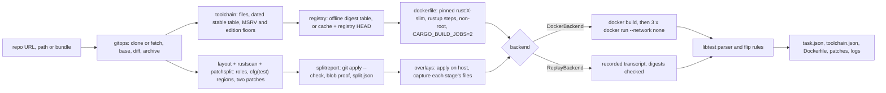

# CargoRewind

[](https://github.com/vipul21435/cargorewind/actions/workflows/ci.yml)

Rebuild a Rust crate at a historical commit inside a digest-pinned Docker image and
prove that a fix commit flips its new tests from failing to passing. CargoRewind is
typed Python that drives git, cargo and Docker. cargo only ever runs inside containers,
so the host needs git and Docker but no Rust toolchain.

Give it a repository and a fix commit. It exports a benchmark-style task bundle:
`task.json` with FAIL_TO_PASS and PASS_TO_PASS lists, the environment `Dockerfile`, a
`test.patch`, a `fix.patch`, a `split.json` report of how the diff was divided, a
`toolchain.json` report of how the toolchain was chosen, and the logs of every run.

## What works today

- **One command, end to end.** `cargorewind rewind <repo> --fix <sha>` clones (or
  fetches) a URL, a local path or a git bundle. It resolves the base commit (by default
  the fix's first parent), splits the diff, picks the toolchain, builds the
  environment, runs the suite three times and writes the bundle.
- **Rust-aware test and fix patch split.** Every changed file gets a Cargo layout
  role: `test`, `source`, `bench`, `example`, `build-script`, `manifest`, `lockfile` or
  `other`. Packages come from every `Cargo.toml`, workspace membership from
  `[workspace] members` globs (`*`, `?`, `[..]`, `**`) minus `exclude`, and targets
  from `[lib]`, `[[bin]]`, `[[test]]`, `[[bench]]`, `[[example]]` and
  `package.build`, custom paths included, plus Cargo's auto-discovery (honoring
  `autotests = false` and the other auto flags). A module-tree walk from each target
  root follows `mod name;` the way rustc resolves it (`name.rs`, `name/mod.rs`,
  `#[path]`, declarations nested in inline modules), so a module file reached only
  through `#[cfg(test)] mod tests;` goes to `test.patch` whole. Files the walk cannot
  reach fall back to path conventions. The walk only descends toward changed files.
- **A small Rust lexer instead of a brace scan.** It skips line, doc and nested block
  comments and knows strings, raw strings (`r#"..."#`), byte and C strings, char and
  byte literals, lifetimes, labels and raw identifiers. On top of it, the scanner finds
  test-only code: inline `#[cfg(test)]` modules, out-of-line `#[cfg(test)] mod name;`
  declarations, single items, fields and statements, inner `#![cfg(test)]`, and
  compound predicates. `cfg(all(test, ...))` and `cfg(any(test, doctest))` count;
  `cfg(not(test))` and `cfg(any(test, feature = "x"))` do not. Changed lines inside
  those regions go to `test.patch`, the rest to `fix.patch`, and hunk ranges are
  recomputed for the intermediate tree.
- **`cargorewind split` and `split.json`, no Docker needed.** The command prints each
  file's role and patch, the test-only regions and the hunks of files shared by both
  patches. It writes `test.patch`, `fix.patch` and `split.json`, which lists packages
  and targets, per-file decisions with reasons, every shared-file hunk with its header
  in each patch, the `cfg(test)` regions and the check results.
- **Split proof.** `git apply --check` must accept `test.patch` on a clean checkout of
  base and `fix.patch` on top of it. Then both are applied, and the result has to match
  the fix commit's blob ids for every touched path. `rewind` runs the same checks and
  stops before Docker if one fails.
- **Toolchain inference with a reason for every step.** Toolchain files are read with
  rustup's rules. `rust-toolchain.toml` gives `channel`, `components`, `targets` and
  `profile`. The legacy `rust-toolchain` file can be a bare channel line or the same
  TOML, and it wins when both files exist, as it does in rustup. Channel forms:
  - an exact version (`1.56` becomes the newest `1.56.x`);
  - `stable-YYYY-MM-DD`, which becomes the release of that day;
  - dated `nightly-YYYY-MM-DD` and `beta-YYYY-MM-DD`;
  - undated `nightly` and `beta`, which become the channel of the day before the
    commit.

  A host-triple suffix is dropped. With no file, or an undated `stable`, CargoRewind
  uses the newest stable release published on an earlier UTC day than the fix. The
  result is then raised to the highest floor from the root package and the root
  workspace's members:
  - every `package.rust-version`, including `rust-version.workspace = true` inherited
    from `[workspace.package]`;
  - the edition minimum (2018 -> 1.31, 2021 -> 1.56, 2024 -> 1.85), including
    per-target `edition` keys;
  - 1.64 when a manifest inherits from the workspace.

  Dated channels are installed with rustup on the pinned `rust:1.98.1-slim` image.
  They are never raised; a warning is recorded when one looks older than a floor.
  `cargorewind toolchain` prints each decision, and `toolchain.json` records them all.
- **Tested release table.** All 140 stable releases from 1.0.0 to 1.98.1 (41 of them
  point releases), parsed from rust-lang/rust `RELEASES.md`. Invariant tests check
  that versions and dates increase, that minors are consecutive and 41 to 43 days
  apart on Thursdays (with the three real exceptions), and that every point release
  follows its predecessor and comes before the next minor.
- **Digest-pinned images, offline or from the registry.** By default the base image
  comes from an offline table of multi-arch `rust:<version>-slim` index digests
  (8 versions). `--registry` looks the tag up in the Docker Hub registry HTTP API:
  an anonymous pull token, then a HEAD request whose `Docker-Content-Digest` is the
  index digest (HEAD does not count as a pull). Answers are cached in a JSON file
  (`--cache-dir`, default `~/.cache/cargorewind`), and the offline table is the
  fallback when the registry cannot answer. `task.json` records where the digest
  came from. `--image name@sha256:...` overrides both.
- **Deterministic environment Dockerfile.** Pinned base, non-root user,
  `LABEL project=cargorewind`, `CARGO_BUILD_JOBS=2`, `cargo fetch --locked` when a
  `Cargo.lock` is committed (otherwise `cargo generate-lockfile`), and a warm
  `cargo test --no-run`. As root, before the user switch, it runs
  `rustup toolchain install` for a dated channel and `rustup component add` or
  `target add` for what the toolchain file lists. It sets `RUSTUP_TOOLCHAIN` whenever
  the checkout has a toolchain file, so rustup cannot switch to the file's channel
  at run time (for example `stable`, which would mean today's stable).
- **Three isolated runs.** base (no patches), before (test patch) and after (test and
  fix patches). Each run streams its changed files into
  `docker run --network none` as a tar on stdin, so it needs no bind mounts and no git
  or `patch` inside the old image.
- **libtest text parser and flip rules.** Handles `ok`, `FAILED`, `ignored`,
  `should panic` and bench lines. Doctest names get a per-item ordinal instead of the
  line number, so they stay stable when a patch shifts lines. When the before run fails
  to compile, the base run decides whether an existing test counts as PASS_TO_PASS
  instead of inflating FAIL_TO_PASS. Regressions block verification.
- **Record and replay.** `--record` writes a transcript of the Docker runs.
  `--replay` answers from that transcript offline, but only when the Dockerfile and
  every file overlay are byte-identical to the recorded ones, checked by sha256.

## Quickstart

```sh
git clone https://github.com/vipul21435/cargorewind && cd cargorewind
make install     # uv sync --frozen
make demo        # offline: replays the recorded Docker runs of a real strsim-rs fix
make split-demo  # offline: only the patch split of the same fix, with split.json
make toolchain-demo  # offline: every toolchain decision for the same fix, toolchain.json
make check       # ruff, mypy --strict, pytest with the 90% coverage gate
make demo-live   # needs Docker: builds rust:1.39.0-slim and runs all three stages
```

## Usage

```sh
cargorewind split <git-url | path | bundle> --fix <sha> [--base <sha>] [--out out/split]
    [--workdir .cargorewind/<name>]
cargorewind toolchain <git-url | path | bundle> <fix-sha> [--base <sha>]
    [--json toolchain.json] [--workdir .cargorewind/<name>]
    [--registry | --offline] [--cache-dir ~/.cache/cargorewind]
cargorewind rewind <git-url | path | bundle> --fix <sha> [--base <sha>] [--out out]
    [--workdir .cargorewind/<name>] [--image rust:X-slim@sha256:...]
    [--registry | --offline] [--cache-dir ~/.cache/cargorewind]
    [--record transcript.json | --replay transcript.json] [--timeout 3600]
```

`toolchain` reads toolchain files and manifests at the fix's base commit and dates the
release rule by the fix's committer date, exactly as `rewind` does.

Exit codes: `split` returns 0 when every check passes and 1 otherwise. `toolchain`
returns 0 when it resolves a toolchain and a pinned image and 1 otherwise. `rewind` returns
0 when the flip is verified, 2 when the runs complete but the flip is not verified, and
1 on errors (unknown commit, patch that does not apply, unpinned toolchain, transcript
mismatch).

### The full rewind

Real output of `make demo`. The fix is strsim-rs
[`605c81c9b9`](https://github.com/rapidfuzz/strsim-rs/commit/605c81c9b9dfaeb8c26c92129fbd5d0f567e0fb8),
"Fix Jaro and Jaro-Winkler when the length is one". It changes one code hunk and adds
two `#[test]` functions inside `mod tests` of the same `src/lib.rs`, which is the case
where test and source code share one file:

```text
mode      replay of examples/strsim/transcript.json (no Docker)
base      c4cdd9c35dfa (first parent of fix)
fix       605c81c9b9df  committed 2019-12-13T02:48:41+00:00
split     test.patch 1 file(s), fix.patch 2 file(s)
shared    src/lib.rs @@ -72,9 +72,11 @@: 0 test line(s), 6 fix line(s)
shared    src/lib.rs @@ -491,6 +493,11 @@: 5 test line(s), 0 fix line(s)
shared    src/lib.rs @@ -561,6 +568,11 @@: 5 test line(s), 0 fix line(s)
check     test.patch applies at base (git apply --check): ok
check     fix.patch applies on top (git apply --check): ok
check     both patches reproduce the fix (2 paths): ok
toolchain 1.39.0: newest stable before 2019-12-13 (1.39.0 released 2019-11-07)
image     rust:1.39.0-slim@sha256:b47dd7b5f59bea2bc19ac18e81cc6b5b3cfe6c4e40082cab09604b296bca2652
lockfile  none: generated
build     cargorewind/strsim-rs:c4cdd9c35dfa
run       base   exit   0  102 passed, 0 failed, 0 ignored
run       before exit 101  102 passed, 2 failed, 0 ignored
run       after  exit   0  104 passed, 0 failed, 0 ignored
FAIL_TO_PASS  2
  tests::jaro_same_one_character
  tests::jaro_winkler_same_one_character
PASS_TO_PASS  102
verdict       VERIFIED fail-to-pass flip
bundle        out/demo/ (task.json, split.json, Dockerfile, test.patch, fix.patch, logs/)
```

The live run (`make demo-live`) prints the same lines without the `mode` line. An
excerpt of the exported `out/demo/task.json`:

```json
{
  "schema_version": 1,
  "base_commit": "c4cdd9c35dfaf7fa4e5e023d22854180b114dd9c",
  "fix_commit": "605c81c9b9dfaeb8c26c92129fbd5d0f567e0fb8",
  "toolchain": {
    "version": "1.39.0",
    "source": "release-date",
    "reason": "newest stable before 2019-12-13 (1.39.0 released 2019-11-07)",
    "image_version": "1.39.0", "rustup_install": false, "toolchain_file": null,
    "decisions": [{"step": "file", "outcome": "none", "reason": "..."}, "...6 steps..."]
  },
  "image": "rust:1.39.0-slim@sha256:b47dd7b5f59bea2bc19ac18e81cc6b5b3cfe6c4e40082cab09604b296bca2652",
  "image_source": {"source": "offline-table", "reason": "offline digest table"},
  "toolchain_report": "toolchain.json",
  "lockfile": "generated",
  "test_command": "cargo test --no-fail-fast",
  "split": {"test_files": ["src/lib.rs"], "fix_files": ["CHANGELOG.md", "src/lib.rs"],
            "shared_files": ["src/lib.rs"], "report": "split.json", "...": "..."},
  "runs": {"before": {"exit_code": 101, "timed_out": false, "passed": 102, "failed": 2,
                      "ignored": 0}, "...": "..."},
  "FAIL_TO_PASS": ["tests::jaro_same_one_character", "tests::jaro_winkler_same_one_character"],
  "PASS_TO_PASS": ["damerau_levenshtein_works", "hamming_works", "...102 names..."],
  "regressions": [],
  "still_failing": [],
  "verified": true
}
```

The generated environment `Dockerfile` for that task:

```dockerfile
# Generated by cargorewind: environment at base commit c4cdd9c35dfaf7fa4e5e023d22854180b114dd9c.
FROM rust:1.39.0-slim@sha256:b47dd7b5f59bea2bc19ac18e81cc6b5b3cfe6c4e40082cab09604b296bca2652
LABEL project=cargorewind \
      cargorewind.base-commit=c4cdd9c35dfaf7fa4e5e023d22854180b114dd9c \
      cargorewind.toolchain=1.39.0
ENV CARGO_BUILD_JOBS=2 \
    CARGO_INCREMENTAL=0 \
    CARGO_TERM_COLOR=never \
    CARGO_TARGET_DIR=/home/rewind/target
RUN useradd --create-home --uid 10001 rewind
USER rewind
WORKDIR /home/rewind/repo
COPY --chown=rewind:rewind repo/ ./
# No Cargo.lock at the base commit: resolve one now. The resolution is not
# yet bounded by the commit date (see PLAN.md, slice 3).
RUN cargo generate-lockfile
# Warm build: compile dependencies and every test target once at base.
RUN cargo test --no-run
```

### The split on its own

Real output of `make split-demo` on strsim-rs
[`605c81c9b9`](https://github.com/rapidfuzz/strsim-rs/commit/605c81c9b9dfaeb8c26c92129fbd5d0f567e0fb8)
(no Docker, 0.42 s wall on a fresh work directory):

```text
base      c4cdd9c35dfa (first parent of fix)
fix       605c81c9b9df  committed 2019-12-13T02:48:41+00:00
packages  1 in the tree; touched: . (strsim)
file      other   fix   CHANGELOG.md
file      source  both  src/lib.rs [lib]
region    src/lib.rs:414-873 module tests, cfg(test)
split     test.patch 1 file(s), fix.patch 2 file(s)
shared    src/lib.rs @@ -72,9 +72,11 @@: 0 test line(s), 6 fix line(s)
shared    src/lib.rs @@ -491,6 +493,11 @@: 5 test line(s), 0 fix line(s)
shared    src/lib.rs @@ -561,6 +568,11 @@: 5 test line(s), 0 fix line(s)
check     test.patch applies at base (git apply --check): ok
check     fix.patch applies on top (git apply --check): ok
check     both patches reproduce the fix (2 paths): ok
wrote     out/split/ (test.patch, fix.patch, split.json)
```

The two test hunks move up by two lines in `test.patch` (`@@ -491,6 +491,11 @@`),
because at that point the fix hunk above them has not been applied yet. An excerpt of
`out/split/split.json`:

```json
{
  "files": [
    {"path": "CHANGELOG.md", "status": "modified", "role": "other", "package": ".",
     "target": null, "patch": "fix", "reason": "not part of a Cargo target"},
    {"path": "src/lib.rs", "status": "modified", "role": "source", "package": ".",
     "target": "lib", "patch": "both", "reason": "lib target root"}
  ],
  "shared_hunks": [
    {"path": "src/lib.rs", "hunk": "@@ -72,9 +72,11 @@", "test_lines": 0, "fix_lines": 6,
     "test_patch_hunk": null, "fix_patch_hunk": "@@ -72,9 +72,11 @@"},
    {"path": "src/lib.rs", "hunk": "@@ -491,6 +493,11 @@", "test_lines": 5, "fix_lines": 0,
     "test_patch_hunk": "@@ -491,6 +491,11 @@", "fix_patch_hunk": null},
    "..."
  ],
  "cfg_test_regions": [
    {"path": "src/lib.rs", "revision": "fix", "kind": "module", "name": "tests",
     "cfg": "test", "start_line": 414, "end_line": 873}
  ],
  "checks": {"test_patch_applies_at_base": true,
             "fix_patch_applies_after_test_patch": true, "patches_reproduce_fix": true}
}
```

strsim-rs is one package, so the workspace and custom-path cases are covered by
fixture tests (`uv run pytest tests/test_layout.py tests/test_patchsplit.py`). They
include a workspace with member globs and an excluded crate; custom `[lib]`,
`[[test]]`, `[[bench]]`, `[[example]]` and `build` paths; and a new out-of-line
`#[cfg(test)] mod more_tests;` added in the same commit as a code fix. Each of the 11
per-role diffs is committed to a temporary git repository, split, and proven with
`git apply --check`.

The CLI also ships as an image: `make docker-demo` builds it (digest-pinned
`python:3.12-slim`, git, a pinned static docker CLI, non-root user) and runs the same
replayed demo inside it.

### Toolchain inference

Real output of `make toolchain-demo` (offline, 0.21 s wall on a fresh work directory).
It covers the same strsim-rs fix: no toolchain file and no MSRV, so the date rule
decides and the edition 2015 floor is trivially met:

```text
base      c4cdd9c35dfa (first parent of fix)
fix       605c81c9b9df  committed 2019-12-13T02:48:41+00:00
file      none: no rust-toolchain.toml or rust-toolchain at the root
date      1.39.0: newest stable before 2019-12-13 (1.39.0 released 2019-11-07)
manifest  1 package(s): root package and root workspace members
edition   1.0.0: package strsim (Cargo.toml) uses edition 2015 (no edition key)
msrv      none: no package sets rust-version
floor     1.0.0: 1.39.0 meets every floor
toolchain 1.39.0 (release-date): newest stable before 2019-12-13 (1.39.0 released 2019-11-07)
image     rust:1.39.0-slim@sha256:b47dd7b5f59bea2bc19ac18e81cc6b5b3cfe6c4e40082cab09604b296bca2652
          offline-table: offline digest table
wrote     out/toolchain/toolchain.json
```

A second real run on a workspace that pins a dated nightly with components:
[TheBevyFlock/bevy_cli](https://github.com/TheBevyFlock/bevy_cli) (MIT OR Apache-2.0)
at `e19ba4e568`, with the live registry lookup. Command:
`uv run cargorewind toolchain https://github.com/TheBevyFlock/bevy_cli e19ba4e568
--registry --cache-dir <dir>`. It took 4.17 s wall, including the clone:

```text
base      2699211b1694 (first parent of fix)
fix       e19ba4e568a4  committed 2026-09-27T17:23:50+00:00
file      rust-toolchain.toml: channel nightly-2026-04-16; components rustc-dev, llvm-tools
channel   nightly-2026-04-16: rust-toolchain.toml pins a dated nightly channel
manifest  2 package(s): root package and root workspace members (1 member manifest(s))
edition   1.85.0: package bevy_cli (Cargo.toml) sets edition = 2024
edition   1.85.0: package bevy_lint (bevy_lint/Cargo.toml) sets edition = 2024
msrv      none: no package sets rust-version
floor     1.85.0: nightly-2026-04-16 builds 1.97.0-nightly, which meets every floor
install   nightly-2026-04-16: rustup toolchain install on the pinned rust:1.98.1-slim image
toolchain nightly-2026-04-16 (rust-toolchain.toml): rust-toolchain.toml pins a dated nightly channel
image     rust:1.98.1-slim@sha256:4cd829461bd5c4d511c32e269da9cb8929223b666519d8004e35fc8d1d771ab7
          registry: HEAD https://registry-1.docker.io/v2/library/rust/manifests/1.98.1-slim (application/vnd.oci.image.index.v1+json); matches the offline table
```

A second lookup of the same tag is answered from the cache (`source: cache`). The same
registry lookup on the replayed strsim-rs demo resolves `rust:1.39.0-slim` to the digest
in the offline table. The replay checks the Dockerfile's sha256, so it would refuse to
answer if the digest had drifted.

The raise path is covered by fixture tests (`tests/fixtures/toolchain/`). A
`rust-toolchain` pin of `1.60` with `rust-version = "1.65"` becomes
`1.65.0 (rust-version)`, with the decision
`raise     1.65.0: raised from 1.60.0 to meet 1.65.0: package msrv-raise (Cargo.toml) sets rust-version = 1.65`.
In a workspace committed on the day 1.85.0 came out, the date rule gives 1.84.1, and
a member on edition 2024 raises it to 1.85.0.

The dated-channel Dockerfile was checked once by hand in Docker. `render_dockerfile`
was run for a scratch crate pinned to `nightly-2020-01-01` with
`components = ["rustfmt"]`, which renders these toolchain lines:

```dockerfile
FROM rust:1.98.1-slim@sha256:4cd829461bd5c4d511c32e269da9cb8929223b666519d8004e35fc8d1d771ab7
...
# Dated channel nightly-2020-01-01: installed with rustup on the pinned stable image.
RUN rustup toolchain install nightly-2020-01-01 --profile minimal --component rustfmt
# Pin the chosen toolchain; rustup would otherwise follow the toolchain file.
ENV RUSTUP_TOOLCHAIN=nightly-2020-01-01
RUN useradd --create-home --uid 10001 rewind
USER rewind
```

`docker build` took 2 min 7 s, including the pull of `rust:1.98.1-slim`. Then
`docker run --network none` as user `rewind` printed
`rustc 1.42.0-nightly (119307a83 2019-12-31)`, which matches the inferred
`1.42.0-nightly`. It also found rustfmt `1.4.11-nightly` and reported
`test tests::adds ... ok`.

## Architecture



| Module | Role |
| --- | --- |
| `runner.py` | `Runner` protocol: the single process boundary; tests swap in a fake |
| `gitops.py` | typed git: clone or fetch, rev-parse, diff, archive, apply, blob comparison |
| `rustlex.py` | small Rust lexer: comments, all string and char literal forms, lifetimes |
| `rustscan.py` | test-only regions (`cfg(test)` modules, items, declarations) and `mod name;` |
| `layout.py` | packages, workspace members, targets, module-tree walk, file roles |
| `patchsplit.py` | unified-diff parser and the role-aware, line-level test and fix split |
| `splitreport.py` | `git apply --check` proof and the `split.json` document |
| `toolchain.py` | stable release table, toolchain files, channels, MSRV and edition floors, decisions |
| `registry.py` | image digests: offline table, JSON cache, registry HTTP API v2 client |
| `toolchainreport.py` | toolchain inference for a commit pair and the `toolchain.json` document |
| `dockerfile.py` | deterministic environment Dockerfile from a `Recipe`, rustup steps included |
| `backend.py` | Docker, recording and replay backends; file overlays as tar streams |
| `libtest.py` | libtest text parser and the three-run flip classification |
| `rewind.py` | the pipeline and the `task.json` document |
| `cli.py` | Typer CLI: `split`, `toolchain`, `rewind`, `doctor`, `version` |

## Measured

| What | Number | Command |
| --- | --- | --- |
| Tests (no Docker) | 260 passed, 1 Docker test deselected | `make cov` |
| Line and branch coverage of `src/` | 98.39% (gate: 90%) | `make cov` |
| Toolchain and registry tests | 72 passed | `uv run pytest tests/test_toolchain.py tests/test_registry.py` |
| Lexer, scanner, layout and split tests | 130 passed | `uv run pytest tests/test_rustlex.py tests/test_rustscan.py tests/test_layout.py tests/test_patchsplit.py tests/test_splitreport.py` |
| Offline split of the demo fix, fresh work directory | 0.42 s wall | `rm -rf .cargorewind out && time make split-demo` |
| Scanner speed on strsim-rs `src/lib.rs` (873 lines) | 7.5 ms per file (3.3 MB/s) | mean of 20 `scan_source` calls (see the note below the table) |
| Live Docker e2e test | 1 passed | `make e2e` |
| Live e2e on GitHub Actions (amd64: pull, build, three runs) | 23 s step time | CI run [36631820323](https://github.com/vipul21435/cargorewind/actions/runs/36631820323), step "Live end-to-end rewind" |
| Offline demo, fresh work directory | 0.54 s wall (median of 3) | `rm -rf .cargorewind out && time make demo` |
| Offline toolchain inference of the demo fix, fresh work directory | 0.21 s wall | `rm -rf .cargorewind out && time make toolchain-demo` |
| Toolchain inference of bevy_cli `e19ba4e568` with live registry lookup, fresh clone | 4.17 s wall | `time uv run cargorewind toolchain https://github.com/TheBevyFlock/bevy_cli e19ba4e568 --registry --cache-dir <dir>` |
| Dated nightly Dockerfile (`nightly-2020-01-01` + rustfmt), including the rust:1.98.1-slim pull | 2 min 7 s build | `time docker build` of the rendered Dockerfile (see "Toolchain inference") |
| First live run, including the rust:1.39.0-slim pull | 1 min 55 s wall | `time uv run cargorewind rewind examples/strsim/strsim-rs.bundle --fix 605c81c9b9 --out out/demo-live --record ...` |
| Demo flip | 2 FAIL_TO_PASS, 102 PASS_TO_PASS | `make demo` |
| Stable releases in the toolchain table | 140 (1.0.0 to 1.98.1), 41 point releases | `uv run python -c "from cargorewind.toolchain import STABLE_RELEASES as s; print(len(s), sum(not v.endswith('.0') for v, _ in s))"` |

Unless marked as CI, numbers come from an Apple Silicon Mac (8 GB RAM) on 2026-09-30.
The scanner timing ran `scan_source` 20 times on `src/lib.rs` at `605c81c9b9` inside
`uv run python` and divided the elapsed `time.perf_counter()` by 20.

## Design decisions

- **The host never runs cargo.** Every `docker` and `git` call goes through one
  `Runner`, so unit tests use a fake runner or throwaway git repositories and never
  need Docker. One `docker`-marked test runs the live path, and CI runs it.
- **Three runs, not two.** A test patch that calls a function only the fix adds makes
  the before run fail to compile, and then every test looks like it failed. The base
  run tells existing passing tests (PASS_TO_PASS) apart from real new failures.
- **Patches applied on the host, files streamed into the container.** Old
  `rust:*-slim` images have neither git nor `patch`, and their Debian releases have
  moved to archive.debian.org, so installing them is fragile. So the host applies the patches, checks that they reproduce the fix, and pipes
  the changed files in as a deterministic tar (`tar -xm` refreshes mtimes so cargo
  rebuilds them).
- **Replay is checked, not trusted.** The offline demo replays a real Docker run of
  strsim-rs. The replay refuses to answer if the Dockerfile or any overlay differs
  from what was recorded, so drift in the split or toolchain logic fails the demo
  instead of silently reusing stale output.
- **A module walk, not a directory guess.** Whether a file is test code depends on how
  it is declared, not on where it sits: `src/tests.rs` is test code when `lib.rs` says
  `#[cfg(test)] mod tests;` and library code when it says `mod tests;`. So the split
  resolves modules from each target root with rustc's rules, including `#[path]` (whose
  file acts like a `mod.rs`), and uses directory conventions only as a fallback. A
  hand-written lexer (no native parser dependency) is enough, because the scanner needs
  only attributes, `mod` items and balanced delimiters, never full syntax trees.
- **Stable doctest names.** libtest names doctests by line number, and a fix that adds
  lines above them renames them. Replacing the number with a per-item ordinal keeps
  PASS_TO_PASS from misreporting shifted doctests as new tests.
- **Pins first, floors second, every step explained.** The toolchain file is what
  the developers ran, and the date rule is the best guess when there is none. A pin
  below `rust-version` or the edition minimum cannot build (cargo refuses it), so a
  stable result is raised and the raise is recorded with the package that forced it.
  A dated nightly is kept, because raising it would change the channel. The checkout
  still contains the toolchain file, so the Dockerfile sets `RUSTUP_TOOLCHAIN`.
  Without it, rustup would follow the file at run time, and a `stable` file would
  install today's stable.
- **Offline by default, registry on request.** The reviewed digest table makes
  `make demo` and the unit tests fully offline and deterministic. `--registry` fills
  the gaps with a HEAD request that costs no pull quota, and the cache makes the
  first answer stick.
- **Demo crate.** rapidfuzz/strsim-rs (MIT, zero dependencies, compiles in seconds).
  Its history up to the fix is bundled in `examples/strsim/strsim-rs.bundle` with its
  license in `examples/strsim/LICENSE-strsim-rs`.

## Known issues

- Without a committed `Cargo.lock`, `cargo generate-lockfile` resolves the newest
  versions, not versions published before the commit date. Old crates with
  dependencies may then fail to build on the old toolchain.
- The split reads `cfg` predicates only. A `#[test]` function outside a `cfg(test)`
  region (rustc compiles it only for tests) counts as source code, and so does a
  `#[cfg_attr(test, path = "...")]` module.
- Manifest and lockfile changes go to `fix.patch` whole, including a
  `[dev-dependencies]` entry that only a new test needs. Such a test fails to compile
  in the before run, which still counts as failing. Benches, examples and build
  scripts go to `fix.patch`, apart from their test-only lines.
- A new source file keeps its test-only code in `fix.patch` (with a note), because
  its `mod` declaration belongs to the fix.
- The module walk does not expand macros or `include!`. It does not follow a `#[path]`
  that leaves the directories of the changed files. It does not model the edition
  2015 rule that turns off target auto-discovery once any target of that kind is
  listed. Files it cannot reach fall back to path conventions.
- Every `Cargo.toml` in the tree is read with its own `git show`, so a workspace with
  hundreds of crates spends a few seconds on manifests.
- The whole suite runs with `cargo test --no-fail-fast`. There is no selection of
  tests by exact name and no flaky-test detection by reruns. Test names are not
  qualified by test binary, so a name that appears in two binaries is merged (a
  failure wins).
- Toolchain floors come from the root package and the root workspace's members only.
  Path dependencies outside the workspace and the Cargo.lock format version are not
  considered; lockfile format checks belong to slice 3.
- A dated nightly or beta is never raised to a floor; only a warning is recorded. Its
  version is estimated as the stable minor of that day plus 2 (nightly) or plus 1
  (beta). That was right for `nightly-2020-01-01` (1.42.0-nightly) and
  `nightly-2019-12-01` (1.41.0-nightly), but it can be one minor off in the days
  around a release. A dated nightly that was never published, or that lacks a
  requested component, fails at `docker build`.
- On a stable image, a toolchain file's `profile` is ignored (the slim images carry the
  minimal profile); listed components are added. Custom `path` toolchains are
  rejected.
- The registry lookup supports Docker Hub only. Cached answers never expire;
  deleting the cache file forces a new lookup. Offline, the digest table covers
  8 versions, and other versions need `--registry` or `--image`.
- The bundle does not contain the base source tree, and there is no `verify` command
  that rebuilds from a bundle alone. There is no recipe-hash build cache beyond
  Docker's own layer cache.
- Diff paths that git quotes (unusual characters) are not parsed.

## Roadmap

Planned in [PLAN.md](PLAN.md), in order:

1. Dependency reproducibility: lockfile format checks, a lockfile bounded by the
   commit date from crates.io metadata, and `cargo vendor` for offline builds.
2. Sanity probes (identifiers the fix adds must be absent at base) and a recipe-hash
   build cache.
3. Test selection by exact name, a JSON libtest parser for nightly, and flaky
   detection by reruns.
4. A versioned task bundle schema, a `verify` command, batch recipes and a second
   crate in the e2e suite.

## License

MIT, see [LICENSE](LICENSE). The bundled strsim-rs history under `examples/strsim/`
is MIT licensed by its authors; see `examples/strsim/LICENSE-strsim-rs`.
