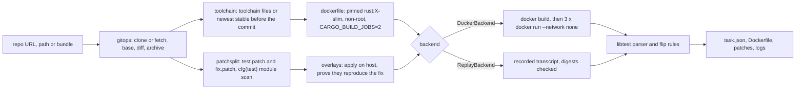

# CargoRewind

[](https://github.com/vipul21435/cargorewind/actions/workflows/ci.yml)

Rebuild a Rust crate at a historical commit inside a digest-pinned Docker image and
prove that a fix commit flips its new tests from failing to passing. CargoRewind is
typed Python that drives git, cargo and Docker. cargo only ever runs inside containers,
so the host needs git and Docker but no Rust toolchain.

Give it a repository and a fix commit. It exports a benchmark-style task bundle:
`task.json` with FAIL_TO_PASS and PASS_TO_PASS lists, the environment `Dockerfile`, a
`test.patch`, a `fix.patch`, and the logs of every run.

## What works today

- **One command, end to end.** `cargorewind rewind <repo> --fix <sha>` clones (or
  fetches) a URL, a local path or a git bundle. It resolves the base commit (by default
  the fix's first parent), splits the diff, picks the toolchain, builds the
  environment, runs the suite three times and writes the bundle.
- **Test and fix patch split for Rust layouts.** Files under any `tests/` directory go
  to `test.patch`. Rust source files are split line by line: changes inside an inline
  `#[cfg(test)] mod name { ... }` go to `test.patch`, and everything else goes to
  `fix.patch`. The module scan skips comments, nested block comments, strings, raw
  strings and char literals. Hunk ranges are recomputed so that `test.patch` applies at
  base and `fix.patch` applies on top of it. Files that end up in both patches are
  reported, one entry per hunk.
- **Split proof.** Both patches are applied to the host checkout with `git apply`, and
  the result has to match the fix commit's blob ids for every touched path. If it does
  not, the run stops.
- **Toolchain choice.** A `rust-toolchain` or `rust-toolchain.toml` pin at base wins
  (with rustup's rule when both exist). Otherwise CargoRewind uses the newest stable
  release published before the fix commit's date. The table holds all 140 stable
  releases from 1.0.0 to 1.98.1, parsed from rust-lang/rust `RELEASES.md`, with
  invariant tests. The base image comes from an offline table of multi-arch
  `rust:<version>-slim` index digests (8 versions). `--image name@sha256:...`
  overrides it.
- **Deterministic environment Dockerfile.** Pinned base, non-root user,
  `LABEL project=cargorewind`, `CARGO_BUILD_JOBS=2`, `cargo fetch --locked` when a
  `Cargo.lock` is committed (otherwise `cargo generate-lockfile`), and a warm
  `cargo test --no-run`.
- **Three isolated runs.** base (no patches), before (test patch) and after (test and
  fix patches). Each run streams its changed files into
  `docker run --network none` as a tar on stdin, so it needs no bind mounts and no git
  or `patch` inside the old image.
- **libtest text parser and flip rules.** Handles `ok`, `FAILED`, `ignored`,
  `should panic` and bench lines. Doctest names get a per-item ordinal instead of the
  line number, so they stay stable when a patch shifts lines. When the before run fails
  to compile, the base run decides whether an existing test counts as PASS_TO_PASS
  instead of inflating FAIL_TO_PASS. Regressions block verification.
- **Record and replay.** `--record` writes a transcript of the Docker runs.
  `--replay` answers from that transcript offline, but only when the Dockerfile and
  every file overlay are byte-identical to the recorded ones, checked by sha256.

## Quickstart

```sh
git clone https://github.com/vipul21435/cargorewind && cd cargorewind
make install     # uv sync --frozen
make demo        # offline: replays the recorded Docker runs of a real strsim-rs fix
make check       # ruff, mypy --strict, pytest with the 90% coverage gate
make demo-live   # needs Docker: builds rust:1.39.0-slim and runs all three stages
```

## Usage

```sh
cargorewind rewind <git-url | path | bundle> --fix <sha> [--base <sha>] [--out out]
    [--workdir .cargorewind/<name>] [--image rust:X-slim@sha256:...]
    [--record transcript.json | --replay transcript.json] [--timeout 3600]
```

Exit codes: 0 when the flip is verified, 2 when the runs complete but the flip is not
verified, 1 on errors (unknown commit, patch that does not apply, unpinned toolchain,
transcript mismatch).

Real output of `make demo`. The fix is strsim-rs
[`605c81c9b9`](https://github.com/rapidfuzz/strsim-rs/commit/605c81c9b9dfaeb8c26c92129fbd5d0f567e0fb8),
"Fix Jaro and Jaro-Winkler when the length is one". It changes one code hunk and adds
two `#[test]` functions inside `mod tests` of the same `src/lib.rs`, which is the case
where test and source code share one file:

```text
mode      replay of examples/strsim/transcript.json (no Docker)
base      c4cdd9c35dfa (first parent of fix)
fix       605c81c9b9df  committed 2019-12-13T02:48:41+00:00
split     test.patch 1 file(s), fix.patch 2 file(s)
cfg(test) src/lib.rs hunk @@ -491 +493: 5 test line(s) to test.patch, 0 to fix.patch
cfg(test) src/lib.rs hunk @@ -561 +568: 5 test line(s) to test.patch, 0 to fix.patch
toolchain 1.39.0: newest stable before 2019-12-13 (1.39.0 released 2019-11-07)
image     rust:1.39.0-slim@sha256:b47dd7b5f59bea2bc19ac18e81cc6b5b3cfe6c4e40082cab09604b296bca2652
lockfile  none: generated
build     cargorewind/strsim-rs:c4cdd9c35dfa
run       base   exit   0  102 passed, 0 failed, 0 ignored
run       before exit 101  102 passed, 2 failed, 0 ignored
run       after  exit   0  104 passed, 0 failed, 0 ignored
FAIL_TO_PASS  2
  tests::jaro_same_one_character
  tests::jaro_winkler_same_one_character
PASS_TO_PASS  102
verdict       VERIFIED fail-to-pass flip
bundle        out/demo/ (task.json, Dockerfile, test.patch, fix.patch, logs/)
```

The live run (`make demo-live`) prints the same lines without the `mode` line. An
excerpt of the exported `out/demo/task.json`:

```json
{
  "schema_version": 1,
  "base_commit": "c4cdd9c35dfaf7fa4e5e023d22854180b114dd9c",
  "fix_commit": "605c81c9b9dfaeb8c26c92129fbd5d0f567e0fb8",
  "toolchain": {
    "version": "1.39.0",
    "source": "release-date",
    "reason": "newest stable before 2019-12-13 (1.39.0 released 2019-11-07)"
  },
  "image": "rust:1.39.0-slim@sha256:b47dd7b5f59bea2bc19ac18e81cc6b5b3cfe6c4e40082cab09604b296bca2652",
  "lockfile": "generated",
  "test_command": "cargo test --no-fail-fast",
  "split": {"test_files": ["src/lib.rs"], "fix_files": ["CHANGELOG.md", "src/lib.rs"],
            "shared_files": ["src/lib.rs"], "...": "..."},
  "runs": {"before": {"exit_code": 101, "timed_out": false, "passed": 102, "failed": 2,
                      "ignored": 0}, "...": "..."},
  "FAIL_TO_PASS": ["tests::jaro_same_one_character", "tests::jaro_winkler_same_one_character"],
  "PASS_TO_PASS": ["damerau_levenshtein_works", "hamming_works", "...102 names..."],
  "regressions": [],
  "still_failing": [],
  "verified": true
}
```

The generated environment `Dockerfile` for that task:

```dockerfile
# Generated by cargorewind: environment at base commit c4cdd9c35dfaf7fa4e5e023d22854180b114dd9c.
FROM rust:1.39.0-slim@sha256:b47dd7b5f59bea2bc19ac18e81cc6b5b3cfe6c4e40082cab09604b296bca2652
LABEL project=cargorewind \
      cargorewind.base-commit=c4cdd9c35dfaf7fa4e5e023d22854180b114dd9c \
      cargorewind.toolchain=1.39.0
ENV CARGO_BUILD_JOBS=2 \
    CARGO_INCREMENTAL=0 \
    CARGO_TERM_COLOR=never \
    CARGO_TARGET_DIR=/home/rewind/target
RUN useradd --create-home --uid 10001 rewind
USER rewind
WORKDIR /home/rewind/repo
COPY --chown=rewind:rewind repo/ ./
# No Cargo.lock at the base commit: resolve one now. The resolution is not
# yet bounded by the commit date (see PLAN.md, slice 3).
RUN cargo generate-lockfile
# Warm build: compile dependencies and every test target once at base.
RUN cargo test --no-run
```

The CLI also ships as an image: `make docker-demo` builds it (digest-pinned
`python:3.12-slim`, git, a pinned static docker CLI, non-root user) and runs the same
replayed demo inside it.

## Architecture



| Module | Role |
| --- | --- |
| `runner.py` | `Runner` protocol: the single process boundary; tests swap in a fake |
| `gitops.py` | typed git: clone or fetch, rev-parse, diff, archive, apply, blob comparison |
| `rustscan.py` | blanks comments and literals, finds `#[cfg(test)]` inline modules |
| `patchsplit.py` | unified-diff parser and the line-level test and fix split |
| `toolchain.py` | stable release table, toolchain files, pinned image digests |
| `dockerfile.py` | deterministic environment Dockerfile from a `Recipe` |
| `backend.py` | Docker, recording and replay backends; file overlays as tar streams |
| `libtest.py` | libtest text parser and the three-run flip classification |
| `rewind.py` | the pipeline and the `task.json` document |
| `cli.py` | Typer CLI: `rewind`, `doctor`, `version` |

## Measured

| What | Number | Command |
| --- | --- | --- |
| Tests (no Docker) | 90 passed, 1 Docker test deselected | `make cov` |
| Line and branch coverage of `src/` | 97.90% (gate: 90%) | `make cov` |
| Live Docker e2e test | 1 passed | `make e2e` |
| Live e2e on GitHub Actions (amd64: pull, build, three runs) | 23 s step time | CI run [36631820323](https://github.com/vipul21435/cargorewind/actions/runs/36631820323), step "Live end-to-end rewind" |
| Offline demo, fresh work directory | 0.34 s wall | `rm -rf .cargorewind out && time make demo` |
| First live run, including the rust:1.39.0-slim pull | 1 min 55 s wall | `time uv run cargorewind rewind examples/strsim/strsim-rs.bundle --fix 605c81c9b9 --out out/demo-live --record ...` |
| Demo flip | 2 FAIL_TO_PASS, 102 PASS_TO_PASS | `make demo` |
| Stable releases in the toolchain table | 140 (1.0.0 to 1.98.1) | `uv run python -c "from cargorewind.toolchain import STABLE_RELEASES as s; print(len(s))"` |

Unless marked as CI, numbers come from an Apple Silicon Mac (8 GB RAM) on 2026-09-30.

## Design decisions

- **The host never runs cargo.** Every `docker` and `git` call goes through one
  `Runner`, so unit tests use a fake runner or throwaway git repositories and never
  need Docker. One `docker`-marked test runs the live path, and CI runs it.
- **Three runs, not two.** A test patch that calls a function only the fix adds makes
  the before run fail to compile, and then every test looks like it failed. The base
  run tells existing passing tests (PASS_TO_PASS) apart from real new failures.
- **Patches applied on the host, files streamed into the container.** Old
  `rust:*-slim` images have neither git nor `patch`, and their Debian releases have
  moved to archive.debian.org, so installing them is fragile. So the host applies the patches, checks that they reproduce the fix, and pipes
  the changed files in as a deterministic tar (`tar -xm` refreshes mtimes so cargo
  rebuilds them).
- **Replay is checked, not trusted.** The offline demo replays a real Docker run of
  strsim-rs. The replay refuses to answer if the Dockerfile or any overlay differs
  from what was recorded, so drift in the split or toolchain logic fails the demo
  instead of silently reusing stale output.
- **Stable doctest names.** libtest names doctests by line number, and a fix that adds
  lines above them renames them. Replacing the number with a per-item ordinal keeps
  PASS_TO_PASS from misreporting shifted doctests as new tests.
- **Demo crate.** rapidfuzz/strsim-rs (MIT, zero dependencies, compiles in seconds).
  Its history up to the fix is bundled in `examples/strsim/strsim-rs.bundle` with its
  license in `examples/strsim/LICENSE-strsim-rs`.

## Known issues

- Without a committed `Cargo.lock`, `cargo generate-lockfile` resolves the newest
  versions, not versions published before the commit date. Old crates with
  dependencies may then fail to build on the old toolchain.
- The `#[cfg(test)]` scan only finds inline `mod name { ... }` modules. It misses
  out-of-line `mod tests;` files, `cfg(all(test, ...))`, and `#[cfg(test)]` on single
  items. Workspace members and custom `[[test]]` paths are not read from `Cargo.toml`.
  Any `tests/` directory counts as test code; benches and examples go to `fix.patch`.
- The whole suite runs with `cargo test --no-fail-fast`. There is no selection of
  tests by exact name and no flaky-test detection by reruns. Test names are not
  qualified by test binary, so a name that appears in two binaries is merged (a
  failure wins).
- Only exact stable versions and `stable` are accepted from toolchain files; nightly
  and beta channels are rejected. `package.rust-version` and the edition are not used
  yet. The digest table covers 8 versions; other versions need `--image`.
- The bundle does not contain the base source tree, and there is no `verify` command
  that rebuilds from a bundle alone. There is no recipe-hash build cache beyond
  Docker's own layer cache.
- Diff paths that git quotes (unusual characters) are not parsed.

## Roadmap

Planned in [PLAN.md](PLAN.md), in order:

1. Rust-aware patch split: layout roles from `Cargo.toml` (workspaces, custom target
   paths), a Rust lexer for out-of-line and compound `cfg(test)`, and a `split`
   command.
2. Toolchain inference from MSRV (`package.rust-version`) and the edition, dated
   nightly channels, and live registry digest lookup with the offline table as
   fallback.
3. Dependency reproducibility: lockfile format checks, a lockfile bounded by the
   commit date from crates.io metadata, and `cargo vendor` for offline builds.
4. Sanity probes (identifiers the fix adds must be absent at base) and a recipe-hash
   build cache.
5. Test selection by exact name, a JSON libtest parser for nightly, and flaky
   detection by reruns.
6. A versioned task bundle schema, a `verify` command, batch recipes and a second
   crate in the e2e suite.

## License

MIT, see [LICENSE](LICENSE). The bundled strsim-rs history under `examples/strsim/`
is MIT licensed by its authors; see `examples/strsim/LICENSE-strsim-rs`.
